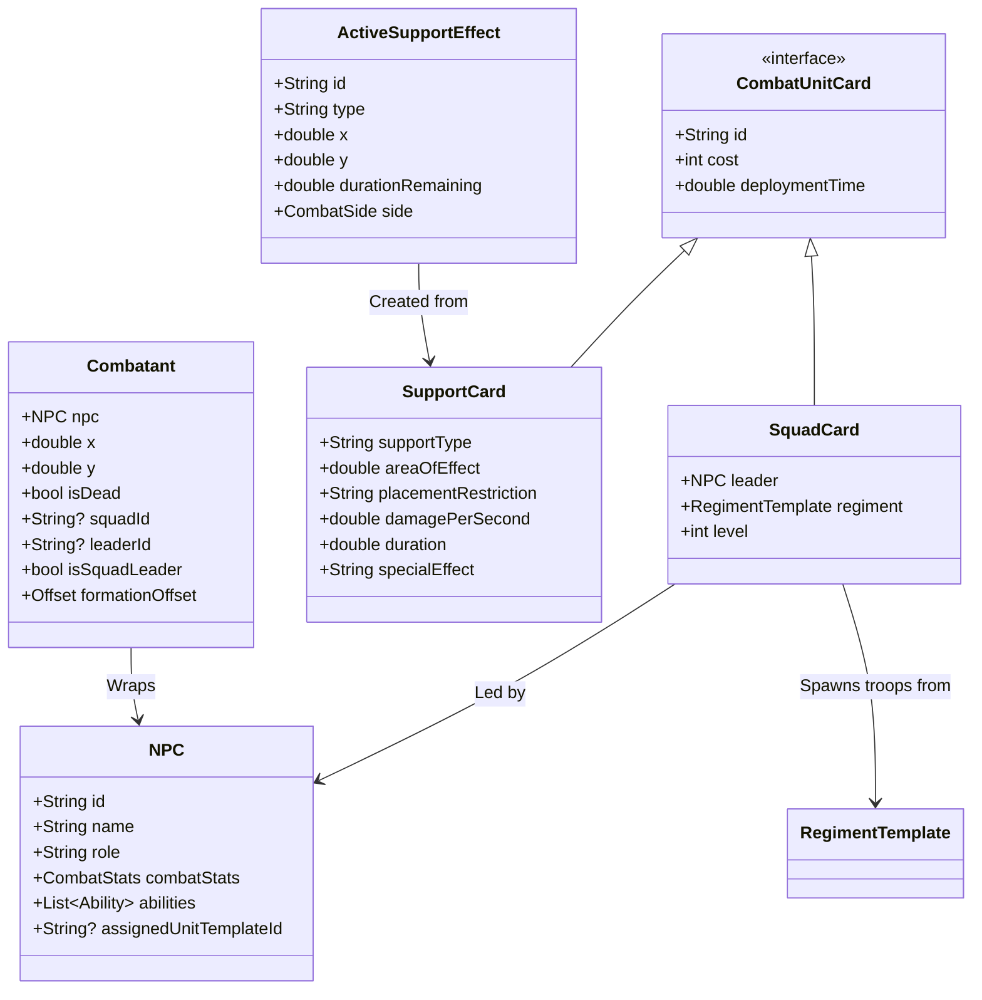

# Combat Overhaul Design Document: Regiment-Scale Battlefields & Support Cards

This document details the architecture, specifications, and implementation plan for reorienting the combat system in *Abomination* from individual-scale matches to battlefield-scale regiment/squad matches.

---

## 1. Executive Summary & Core Vision

The combat system is transitioning to a **battlefield-scale** model where unit cards represent entire **regiments (squads)** rather than single individual characters. 
* Spawning a combat card deploys a **Leader** (the character card itself) alongside a set of **Followers** (troops).
* Every troop in the regiment moves and attacks independently, maintains individual health pools, and coordinates within a cohesive visual formation.
* Combat cards are categorized into **Combat Squads** (summoned troops/vehicles) and **Combat Support** (one-time directional, area-of-effect, or positional effects).

---

## 2. System Architecture & Data Models

The following Mermaid diagram illustrates the relationships between game characters, combat cards, and the combat entities spawned on the battlefield.



### 2.1 Extended Data Structures

#### A. `CombatStats` updates (`lib/models/combat_stats.dart`)
To support the 17 core attributes of squad cards, the `CombatStats` model will be extended with the following fields:
```dart
enum UnitType { squad, vehicle, support }
enum TargetingRule { all, towersOnly, enemyCharacterOnly, squadsOnly, vehiclesOnly, nonTowers }
enum CombatTrait { none, magicImmune, fireVulnerable, constantHeal }
enum DeathknellEffect { none, explosion, mindControl }
enum BattlehornEffect { none, charge, heal }

class CombatStats {
  // Existing fields ...
  final UnitType unitType;
  final int unitCount;             // Number of followers in the squad
  final double rangedDamage;
  final double rangedRange;
  final double rangedAttackSpeed;  // Delay in seconds
  final double meleeDamage;
  final double meleeRange;
  final double meleeAttackSpeed;   // Delay in seconds
  final double deploymentTime;     // Seconds before acting
  final TargetingRule targetingRule;
  final CombatTrait trait;
  final DeathknellEffect deathknell;
  final BattlehornEffect battlehorn;
  // ...
}
```

#### B. `Combatant` additions (`lib/services/combat_manager.dart`)
Each individual troop on the battlefield maps to a `Combatant`. To support cohesive squad actions:
```dart
class Combatant {
  // Existing fields ...
  String? squadId;           // Connects all troops in the same spawned squad
  String? leaderId;          // Maps follower troops to their character leader's NPC id
  bool isSquadLeader;        // True for the character leading the unit
  Offset formationOffset;    // Relational offset from leader's position
  double activeDeploymentTimer; // Remaining deployment countdown
}
```

---

## 3. Core Combat Squad Cards

Every squad card is led by an NPC character. The character shapes the squad's rare traits and special attacks, while the squad template dictates unit sizes, speeds, and health values.

### 3.1 Core Attribute Matrix

All combat unit cards possess the 17 attributes defined below:

| Attribute | Type | Description |
| :--- | :--- | :--- |
| **1. Type** | `UnitType` | `squad`, `vehicle`, or `support` |
| **2. Level** | `int` | Governed by the unit's experience |
| **3. Health** | `double` | Hitpoint pool of *each individual member* |
| **4. Movement Speed** | `double` | Meters per second |
| **5. Ranged Damage** | `double` | Damage dealt per ranged attack |
| **6. Ranged Range** | `double` | Maximum ranged attack distance (meters) |
| **7. Ranged Attack Speed** | `double` | Seconds between ranged attacks |
| **8. Melee Damage** | `double` | Damage dealt per melee attack |
| **9. Melee Range** | `double` | Maximum melee reach (meters) |
| **10. Melee Attack Speed** | `double` | Seconds between melee attacks |
| **11. Deployment Time** | `double` | Time in seconds before unit acts after spawning |
| **12. Unit Count** | `int` | Total number of followers deployed |
| **13. Targeting Rules** | `TargetingRule` | AI filtering rule for selecting enemies |
| **14. Traits** | `CombatTrait` | Passive, constant effects (e.g. fire vulnerability) |
| **15. Deathknell** | `DeathknellEffect` | Triggered when the member is destroyed |
| **16. Battlehorn** | `BattlehornEffect` | Triggered when the unit is deployed |
| **17. Special Attack** | `Ability` | Chargeable custom ability executed by player |

### 3.2 Balance Registry of Example Units

Below is the balance sheet mapping costs, troop sizes, attributes, and balancing trade-offs.

| Unit Name | Cost | Count | HP | Speed (m/s) | Ranged (Dmg/Rng/Spd) | Melee (Dmg/Rng/Spd) | Special / Traits | Trade-offs / Balance Notes |
| :--- | :---: | :---: | :---: | :---: | :---: | :---: | :--- | :--- |
| **Cannoneer** | 3 | 1 | 250 | 0.6 | 90 / 15.0 / 3.5 | 5 / 1.0 / 2.0 | Targets Towers | Long range, high tower damage. Extremely slow and vulnerable in melee. |
| **Musketeers** | 4 | 3 | 180 | 1.0 | 30 / 8.0 / 1.5 | 25 / 1.2 / 1.2 | Well-rounded | High cost but durable, versatile at all ranges. |
| **Cavalry** | 5 | 3 | 220 | 1.8 | 0 / 0.0 / 0.0 | 45 / 1.5 / 1.0 | Vulnerable to fire | Fast flanking unit. Weak to pikemen/fire, cannot damage towers. |
| **Bicycle Gang** | 4 | 3 | 110 | 1.4 | 15 / 6.0 / 1.2 | 10 / 1.0 / 1.0 | None | Fast, medium cost, but low toughness. |
| **Motorcycle Gang** | 5 | 2 | 165 | 2.2 | 20 / 8.0 / 1.0 | 15 / 1.0 / 0.8 | High evasion | Extremely fast, high cost, but long deployment delay (2.5s). |
| **Armored Car** | 6 | 1 | 700 | 1.2 | 18 / 7.0 / 0.8 | 0 / 0.0 / 0.0 | Magic Vulnerable | High tankiness, low damage output. |
| **Wooden Tank** | 7 | 1 | 850 | 0.5 | 110 / 10.0 / 4.0 | 0 / 0.0 / 0.0 | Vulnerable to fire | Massive ranged attack, slow movement speed, high energy cost. |
| **Undead Rats** | 3 | 4 | 65 | 1.2 | 0 / 0.0 / 0.0 | 12 / 0.8 / 0.5 | Constant Heal | Persistent swarm, hard to completely clear. |
| **Rats 2** | 6 | 8 | 45 | 1.5 | 0 / 0.0 / 0.0 | 8 / 0.8 / 0.4 | Vulnerable to fire | Huge swarm size, low individual health, fast but fragile. |
| **Werewolf** | 5 | 1 | 500 | 1.6 | 0 / 0.0 / 0.0 | 75 / 1.5 / 0.9 | Hard to control | High damage, fast, but targets closest unit regardless of type. |
| **Chimera** | 6 | 1 | 650 | 0.8 | 50 / 5.0 / 2.0 | 40 / 1.8 / 1.2 | Fire Breathing | Tough, slow, splash fire damage. |
| **Flesh Golem** | 4 | 1 | 550 | 0.7 | 0 / 0.0 / 0.0 | 60 / 1.2 / 1.4 | Magic Immune | Highly resilient melee unit, immune to spell effects. |
| **Villager Mob** | 3 | 5 | 90 | 0.9 | 0 / 0.0 / 0.0 | 15 / 1.0 / 1.1 | Melee Only | Basic high-count commoner squad. Balanced and cheap. |
| **Samurai** | 4 | 3 | 160 | 1.2 | 0 / 0.0 / 0.0 | 45 / 1.2 / 0.8 | High evasion, Fear Immune | Locked rare unit. High attack speed, avoids physical strikes. |
| **Mercenaries** | 4 | 4 | 120 | 1.0 | 20 / 7.0 / 1.4 | 12 / 1.0 / 1.2 | None | Balanced mid-tier ranged troopers, weak in close combat. |
| **Commandos** | 5 | 3 | 150 | 1.3 | 40 / 4.0 / 0.7 | 35 / 1.0 / 0.7 | None | High attack speed, short ranged fire, versatile. |
| **Sniper** | 3 | 1 | 90 | 0.8 | 85 / 18.0 / 3.0 | 0 / 0.0 / 0.0 | Non-Towers | Heavy single-target range. Useless against fortifications. |
| **Wild Foxes** | 2 | 4 | 45 | 1.6 | 0 / 0.0 / 0.0 | 8 / 0.6 / 0.4 | Fast, vulnerable to fire | Very cheap and fast, but fragile. |
| **Wild Wolves** | 3 | 3 | 90 | 1.5 | 0 / 0.0 / 0.0 | 20 / 1.0 / 0.8 | None | Quick melee pack. Higher damage, moderate toughness. |
| **Wild Bears** | 4 | 1 | 420 | 0.8 | 0 / 0.0 / 0.0 | 55 / 1.4 / 1.3 | Constantly heals self | Slow-moving tank beast. Durable but expensive for beasts. |
| **Bandits** | 2 | 4 | 60 | 1.3 | 0 / 0.0 / 0.0 | 15 / 1.0 / 0.9 | Fast deployment | Extremely cheap, fast deploy time, but weak. |
| **Thugs** | 3 | 3 | 130 | 0.9 | 0 / 0.0 / 0.0 | 22 / 1.0 / 1.2 | Slows enemy on hit | Slow but durable melee squad, good at locking down targets. |
| **Deserters** | 3 | 3 | 80 | 0.9 | 18 / 7.0 / 1.6 | 10 / 1.0 / 1.2 | None | Cheap, medium-range shooters, but low health and low defense. |
| **Halberdiers** | 3 | 3 | 110 | 1.0 | 0 / 0.0 / 0.0 | 25 / 1.4 / 1.1 | Anti-vehicle / cavalry | Good reach and specialized against fast/heavy enemies. |
| **Pikemen** | 3 | 3 | 105 | 0.8 | 0 / 0.0 / 0.0 | 20 / 1.6 / 1.3 | Anti-cavalry (charge block) | Slow movement but extremely effective at stopping enemy charges. |
| **Policemen** | 4 | 2 | 150 | 1.0 | 25 / 5.0 / 1.5 | 15 / 1.0 / 1.0 | Chance to stun | Ranged shotgun/pistol fire with crowd-control stun potential. |
| **Marksmen** | 3 | 2 | 85 | 0.9 | 35 / 10.0 / 2.0 | 0 / 0.0 / 0.0 | Targets squads | Solid, dedicated ranged squad with medium range and damage. |

---

## 4. Combat Support Cards

Support cards do not summon units. Instead, they trigger directional, area-of-effect, or positional status layers.

```
Artillery Barrage Placement Logic:
[Player Character] ====== (Friendly Lane Zone) ======> [Barrage Target Area (Last 20%)]
                                                     ^
                     Only permitted if an allied unit is within ~30% of enemy edge.
```

### 4.1 Support Card Inventory

#### 1. Artillery Barrage
* ** Caster Proximity Rules**: Can be targeted anywhere in a lane. However, to target the enemy's back 20% zone, the player character (Alphonse) or an active allied unit must be positioned within 30% of the enemy's field edge.
* **Effect**: Strikes all targets in a long rectangle (taking up exactly 1/3 of a lane's length and the lane's full width).
* **Stats**: Cost: 5 AP | Damage: 80 DPS | Duration: 4.0s | Deployment delay: 1.5s (warning line indicator).

#### 2. Tear Gas Grenade
* **Caster Proximity Rules**: Can be placed anywhere in a circle centered within 1/10th of the total field length (14 meters/feet) from the current position of the player character.
* **Effect**: Creates a circular gas cloud (12-meter radius). Enemies inside the cloud are slowed by 60% and suffer poison damage.
* **Stats**: Cost: 3 AP | Damage: 15 DPS | Duration: 8.0s | Deployment delay: 0.5s.

#### 3. Caltrops
* **Caster Proximity Rules**: Summons instantly and directly centered on the player character's current coordinates.
* **Effect**: Spawns a square patch (matching lane width). Enemies stepping onto caltrops are slowed by 50% and suffer damage. Deals 2.5x damage to units with the `vehicle` type.
* **Stats**: Cost: 3 AP | Damage: 25 per step (vehicles: 62) | Duration: 60.0s | Deployment delay: Immediate.

#### 4. Vampiric Totem
* **Caster Proximity Rules**: Must follow normal unit summoning restrictions (behind friendly lines: first 20% of field or behind the foremost allied unit on a lane).
* **Effect**: Places a fragile structural totem. Enemies within a 15-meter radius are drained of life (12 HP/sec), which is instantly channeled to heal the lowest-health friendly unit within proximity.
* **Stats**: Cost: 4 AP | Drain Rate: 12 HP/sec | Duration: 60.0s | Totem Health: 150 HP.

### 4.2 Placement Drag-and-Drop Preview Indicator UI

To support precise tactical deployment, a real-time visual preview will be rendered when dragging cards:
1. **Activation**: Triggers immediately when dragging a card from the hand, or when a support card is selected via a hotkey.
2. **Visual Overlay**:
   * **Support Cards**: Renders a shaded shape on the battlefield indicating the exact **Area of Effect** (e.g., a long rectangle for the Artillery Barrage or a circle for the Tear Gas Grenade) that will be generated upon release.
   * **Squad/Unit Cards**: Renders a cluster of small circular markers representing the exact base positions that each member of the squad (leader and followers) will occupy in formation upon spawning.
3. **Color Validation**:
   * **Green Indicator**: Displayed when the current cursor position is valid (within the starting 20% zone, behind friendly lane leaders, or adhering to caster proximity rules).
   * **Red Indicator**: Displayed when the position is invalid (e.g., trying to cast a tear gas grenade too far from Alphonse, or spawning units in the enemy's backline without lane presence). Deactivating the drag over a red indicator cancels deployment without spending AP.

---

## 5. Manor Progression & Profession Mechanics

To tie combat directly to the main gameplay loop, unit availability is governed by two factors: manor resource progression and character profession assignments.

```
                  [ Manor Science Level ]
                            │
         ┌──────────────────┴──────────────────┐
         ▼                                     ▼
[ Scientific Progression ]            [ Financial Progression ]
(High Science, Low Wealth)            (Low Science, High Wealth)
         │                                     │
         ▼                                     ▼
   Bicycle Gang                              Cavalry
         │                                     │
         └──────────────────┬──────────────────┘
                            ▼
             [ Industrial Late Game Stage ]
              (High Science & High Wealth)
                            │
                            ▼
                     Motorcycle Gang
```

### 5.1 Scientific & Financial Progression Stages

* **Early Game (Stage 1)**: 
  * *Unlocks*: Villager Mob, Undead Rats, Wild Foxes, Wild Wolves, Wild Bears, Bandits, Thugs, Deserters, Halberdiers, Pikemen, Policemen, Marksmen.
  * *Manor Requirements*: Default state.
* **Scientific Specialization (Stage 2)**: 
  * *Unlocks*: Bicycle Gang, Flesh Golem, Chemists leading Grenadiers.
  * *Manor Requirements*: Science > 50, Wealth < 30.
* **Financial / Prestige Specialization (Stage 3)**: 
  * *Unlocks*: Cavalry, Mercenaries.
  * *Manor Requirements*: Wealth > 50, Science < 30.
* **Late-Game Industrial Convergence (Stage 4)**: 
  * *Unlocks*: Motorcycle Gang, Armored Car, Wooden Tank, Commandos, Snipers.
  * *Manor Requirements*: Science > 80, Wealth > 80.

### 5.2 Character Profession & Leadership Assignment Rules

When manor residents are assigned to lead combat units:
* **Default Unit**: Any character with a standard profession (e.g. cook, butler, visitor) leads a **Villager Mob** (5 villagers) by default.
* **Profession-Matched Units**:
  * **Chemists / Doctors**: Lead **Grenadiers / Chemists** (ranged chemical slingers).
  * **Engineers / Mechanics**: The only characters capable of piloting **Vehicles** (Armored Car, Wooden Tank).
  * **Soldiers / Watchmen**: Lead **Musketeers** or **Commandos**.
* **Rare Character Locking**:
  * Unique residents (like a Samurai character) are permanently locked to their specific squad type (**Samurai Squad**).
  * These units improve their weapons and armor via Manor upgrades and gain experience, but the characters cannot be reassigned to general units.

### 5.3 UI Integration: Dossier & Constructs Records

To manage assignments outside of combat, the interface will be updated in the following areas:
1. **Dossier Section of Records**:
   * Resident profile pages will feature a dedicated **Combat Assignment** segment.
   * Players can view the character's current combat stats, special abilities (governed by their profession/traits), and select/assign their active combat squad template (e.g., Musketeers, Pikemen) from the pool of unlocked units.
2. **Constructs / Inventions Section**:
   * Each construct, weapon, or invention listed in the Manor's inventory will display a status indicator detailing its combat assignment status.
   * Shows the name and portrait of the specific character who is currently assigned to pilot or lead that unit (e.g., showing that a *Wooden Tank* is piloted by *Engineer Miller*).

---

## 6. Algorithms & Simulation Logic

### 6.1 Navigation, Channel Following & Spatial Partitioning

To ensure stable execution with high unit populations, collision management is optimized for pathing rather than heavy physics calculations:
1. **Scrapping Heavy Collision Physics**: Traditional continuous rigid-body collision solvers are removed. Instead, units rely on coordinate limits and channel bounding boxes to prevent overlapping and bunching.
2. **Grid-Based Spatial Partitioning**: 
   * The battlefield is divided into a static grid (5 sectors along the horizontal axis).
   * Units register their current sector in $O(1)$ time on every tick.
   * Target acquisition and local spacing routines only query entities within the same or adjacent grid sectors, dropping search complexity to near-linear $O(N)$.
3. **Channel Alignment & Path Navigation**:
   * The map's three lanes act as rigid movement channels.
   * When moving toward a target behind centerline walls, the pathfinding system calculates gateway waypoints (e.g., gap coordinates at $X \in [35, 115, 185, 265]$) and slides units along the channel boundaries to prevent stuck states.

### 6.2 Formation Movement Logic

To maintain cohesive squad behavior, follower troops coordinate their movement relative to their squad leader.

```
Squad Formation Offsets (V-Shape):

      [Follower 1] (Offset: -2.5, -2.5)
            \
             --> [Squad Leader] (NPC Character)
            /
      [Follower 2] (Offset: -2.5,  2.5)
```

1. **Target Calculation**: For each follower, the target destination in world space is calculated as:
   $$\vec{P}_{\text{target}} = \vec{P}_{\text{leader}} + \mathbf{R}(\theta) \cdot \vec{O}_{\text{formation}}$$
   Where $\vec{O}_{\text{formation}}$ is the troop's static offset, and $\mathbf{R}(\theta)$ rotates the offset to match the direction the leader is facing.
2. **Autonomous Action**: 
   * If an enemy is within the follower's individual range, it breaks formation slightly to execute its attack.
   * If the leader dies, all remaining followers clear their `leaderId` and transition to fully autonomous individual AI, charging the nearest lane target.

### 6.3 AI Opponent Decision & Placement Engine

The opponent character leader (`ai_mirror`) uses a utility-based scorer to play cards intelligently:
1. **Decision Tick**: Every 1.5 seconds, the AI scans its hand and current AP.
2. **Target Density Scanning**: The AI calculates player unit clusters (density of player units in circles/rectangles) on each lane.
3. **Card Selection Scoring**:
   * **Squad Cards**: Played on the lane with the fewest allied defenders or to counter player pushes.
   * **Artillery Barrage**: Scored high and cast when a player cluster of $\ge 3$ units is detected in a lane.
   * **Tear Gas Grenade**: Targets clusters close to the AI's own character to fend off attackers.
   * **Caltrops**: Summoned immediately on the AI's position if player units cross into the AI's home 20% zone.
   * **Vampiric Totem**: Summoned in a lane behind allied units to support defense when active combat is occurring.

### 6.4 Targeting Filter Logic

During target acquisition, the `TargetingRule` filters the list of available targets:
```dart
List<Combatant> filterTargets(Combatant seeker, List<Combatant> candidates) {
  switch (seeker.npc.combatStats!.targetingRule) {
    case TargetingRule.towersOnly:
      return candidates.where((c) => c.isTower).toList();
    case TargetingRule.enemyCharacterOnly:
      return candidates.where((c) => c.npc.isPlayer || c.npc.id == 'ai_mirror').toList();
    case TargetingRule.squadsOnly:
      return candidates.where((c) => !c.isTower && c.npc.combatStats!.unitType == UnitType.squad).toList();
    case TargetingRule.vehiclesOnly:
      return candidates.where((c) => c.npc.combatStats!.unitType == UnitType.vehicle).toList();
    case TargetingRule.nonTowers:
      return candidates.where((c) => !c.isTower).toList();
    case TargetingRule.all:
    default:
      return candidates;
  }
}
```

---

## 7. Implementation Plan

To implement these features systematically without breaking the existing single-unit matches:

### Phase 1: Model Extensions & Factory Upgrades
1. Add `UnitType`, `TargetingRule`, `CombatTrait`, `DeathknellEffect`, and `BattlehornEffect` enums to `lib/models/combat_stats.dart`.
2. Extend `CombatStats` with new attributes and update JSON serialization.
3. Add squad tracking fields (`squadId`, `leaderId`, `isSquadLeader`, `formationOffset`) to `Combatant`.
4. Refactor `CombatUnitFactory` to support squad generation templates.

### Phase 2: Spawning & Formation Locomotion in `CombatManager`
1. Modify `spawnUnit` in `CombatManager`. When spawning a card with `unitCount > 1`:
   * Spawn the leader character combatant (`isSquadLeader = true`).
   * Loop and spawn $N$ troop combatants with matching `squadId`, `leaderId`, and custom `formationOffset` vectors.
2. Implement formation update ticks in `_processUnitTick`. Update follower positions to track their leader while adding a steering/flocking force to prevent tight overlapping.
3. Implement the `TargetingRule` filter function during target selection.

### Phase 3: Support Card System & Effects
1. Create `ActiveSupportEffect` class in `lib/services/combat_manager.dart`.
2. Implement validation checks in the casting pipeline (e.g. verifying character/ally coordinates before allowing back-row Artillery barrages).
3. Add tick-based loops in `CombatManager.update` to apply poison, slowing forces, damage ticks, and life transfer.

### Phase 4: UI Overhaul & Drag-and-Drop Rendering
1. Update `_CombatScreenState` drag-and-drop handlers to render color-coded (Green/Red) area-of-effect and formation base indicators.
2. Modify unit rendering to use dedicated, predefined static sprites for each troop type (e.g. Musketeers, Pikemen, Undead Rats) instead of dynamic character blobs.
3. Implement the Combat Assignment segment in the Dossier section of the Records screen.
4. Update the Constructs view to display current pilot/leader assignments.

---

> [!IMPORTANT]
> **Integration Safety**: All current single-character encounters will continue to run perfectly by defaulting their `unitCount` to `1` and `unitType` to `UnitType.squad`, ensuring full backward compatibility during implementation.
