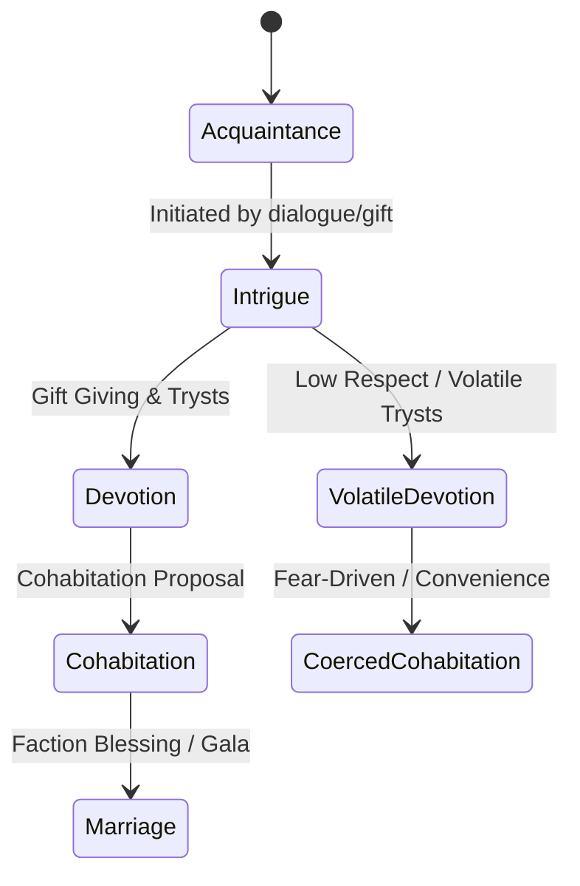
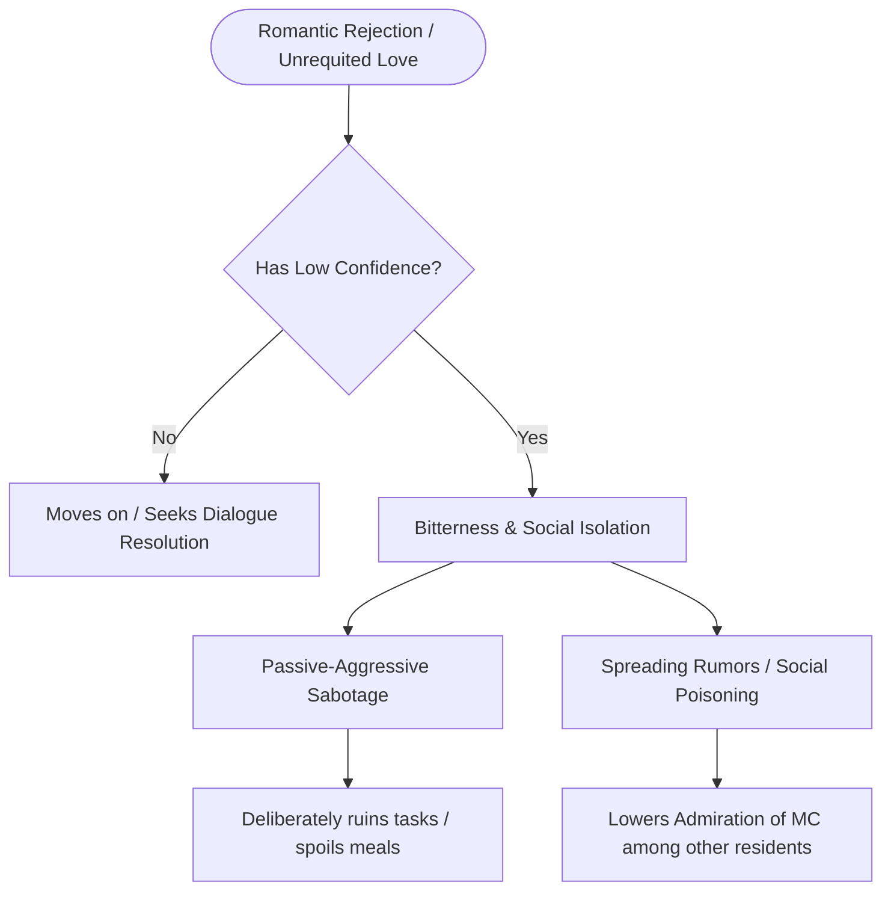

# Courtship, Social Dynamics, and Cohabitation in the Manor

This document outlines the revised design, math, and decision-tree architecture for the **Social Relationship Engine** in *Abomination*. The system moves away from typical "dating sim" tropes, leaning instead into the psychological complexity, domestic friction, and dark undercurrents characteristic of 19th-century gothic horror and the relationship dynamics of Victor Frankenstein and Elizabeth Lavenza.

---

## 1. The Four Pillars of Social Standing

Romantic and domestic life in the Manor is governed by four directed metrics, each shaped by character attributes: **Attraction, Admiration, Fear, and Respect**.

```
                  +-----------------------------------+
                  |      ROMANTIC RELATIONSHIP        |
                  +-----------------------------------+
                                    |
        +------------------+--------+--------+------------------+
        |                  |                 |                  |
        v                  v                 v                  v
+--------------+   +--------------+   +--------------+   +--------------+
|  ATTRACTION  |   |  ADMIRATION  |   |     FEAR     |   |   RESPECT    |
|   (0.0 - 5.0)|   |   (0.0 - 5.0)|   |   (0.0 - 5.0)|   |   (0.0 - 5.0)|
+--------------+   +--------------+   +--------------+   +--------------+
```

### A. Attraction (Romantic & Physical Pull)
Attraction is highly subjective and depends on individual character preferences rather than a flat physical beauty score. Characters possess unique romantic inclinations:
*   **Standard Attraction**: Driven by base physical beauty, vitality, age similarity, and sexual orientation.
*   **Sapiosexuality**: Driven by target's high `Intellect` and `Judgment`. The observer is attracted to deep scientific or philosophical minds.
*   **Confidence-Seekers**: Driven by target's high `Confidence` (Boldness). Often attracts characters looking for protective or commanding partners.
*   **Well-Mannered Preference**: Driven by target's high `Temperament` (calm, structured behavior).
*   **Free-Spirit Preference**: Driven by target's low `Judgment` (impulsive, chaotic, or artistic souls).
*   **Dark Attraction (Fear-Driven)**: Certain rare characters (often with low `Confidence` or high `Submissiveness` traits) find high `Fear` of a target directly boosts `Attraction`.
*   **Horticultural / Medical Fetishes**: Certain eccentric, psychiatric, or alchemically-inclined characters are specifically attracted to target's physical anomalies (e.g. obese body types, missing limbs, or stitched/golem body parts), opening up humorous and bizarre medical-parlor storylines.

### B. Admiration (Social Standing & Social History)
Admiration measures a character’s public and private stature in the eyes of another:
*   **Strangers**: Admiration is initially generated through **Titles, Achievements, Class Standing, and Faction Identity**. A Geneva noble starts with high admiration in royalist circles, but low admiration among Carbonari.
*   **Residents**: As a relationship develops, admiration shifts from superficial traits to a log of **Social History** between them:
    *   *Has this character cheated or betrayed me?*
    *   *Does this character annoy me during shared tasks?*
    *   *Is this character dependable in a crisis?*
    *   *Is this character an exceptional cook?* (Good meals prepared by a roommate boost admiration over time).

### C. Fear (Inherent Gravity & Power Asymmetry)
Fear is a measure of perceived danger, power imbalance, and potential violence. Its activation is highly subjective and depends on the observer's own personality, rather than being a flat global value:
*   **Observer Trait-Based Vulnerabilities**:
    *   *Fear of the Grotesque*: Characters who value aesthetics or possess high sensibilities are primarily terrified of target's low `Beauty` (grotesque or alchemically mutated appearance).
    *   *Fear of the Intimidating*: Physically weaker characters (low `Strength` or low `Endurance`) are primarily terrified of target's high physical `Strength`.
    *   *Fear of the Depraved*: Moral characters (high `Morality`) are primarily terrified of target's low `Morality` (depravity, cruelty, unpredictable behavior).
*   **Strangers**: Fear of strangers is driven by public ignominious accomplishments (e.g., executing dissidents, illegal alchemical surgery gossip) matching the observer's specific fear vulnerability (grotesque, physical, or moral).
*   **Interactions & Proximity**: Hostile dialogue choices in encounters and hostile domestic arguments inside the manor push fear up.
*   **Inherent Terror & Low Temperament Amplification**: 
    *   Low `Temperament` (volatility, prone to rage) serves as a **dynamic driver and multiplier** that amplifies other fearful qualities. A physically strong or morally depraved character becomes exponentially more terrifying if their `Temperament` is low, since this directly drives the frequency and severity of hostile domestic arguments, threats, and aggressive proximity interactions.
    *   High `Intellect` (when combined with low `Morality`) inspires a cold, scheming fear of intellectual manipulation.

### D. Respect (Relationship Gravity & Value)
Rather than simple professional task efficiency, Respect represents the **inherent value and gravity** that a character places on the relationship itself. It dictates how seriously a partner is taken, regardless of attraction:

```mermaid
graph TD
    classDef high fill:#8D996C,stroke:#333,stroke-width:2px;
    classDef low fill:#CF6679,stroke:#333,stroke-width:2px;

    %% 1. Infidelity
    I_Att[High Attraction]:::high --> Infidelity["Infidelity Scenario<br>(Loves but cheats)"]
    I_Adm[High Admiration]:::high --> Infidelity
    I_Fear[Low Fear]:::low --> Infidelity
    I_Resp[Low Respect]:::low --> Infidelity

    %% 2. Hen-pecked
    H_Att[Low Attraction]:::low --> HenPecked["Hen-Pecked Husband<br>(Terrified to leave)"]
    H_Adm[Low Admiration]:::low --> HenPecked
    H_Fear[High Fear]:::high --> HenPecked
    H_Resp[High Respect]:::high --> HenPecked

    %% 3. Devoted Caregiver
    C_Att[Low Attraction]:::low --> Caregiver["Devoted Caregiver<br>(Post-accident loyalty)"]
    C_Adm[High Admiration]:::high --> Caregiver
    C_Fear[Low Fear]:::low --> Caregiver
    C_Resp[High Respect]:::high --> Caregiver

    %% 4. Dangerous Affair
    A_Att[High Attraction]:::high --> Affair["Dangerous Affair<br>(Dating mafia wife)"]
    A_Adm[Low Admiration]:::low --> Affair
    A_Fear[High Fear]:::high --> Affair
    A_Resp[Low Respect]:::low --> Affair
```



*   **Non-Exhaustive Relationship Archetypes**:
    These examples represent common dynamics generated by combinations of the four pillars, but do not dictate rigid outcomes:
    *   **Case 1: Low Respect Bounds (High Attraction, High Admiration, Low Fear, Low Respect)**
        *   *Dynamic*: The partner loves and is highly attracted to their spouse, but does not place gravity/respect on the relationship boundary, which can result in repeated infidelity. *Note*: Low respect does not always manifest as adultery; a character might have low respect for their spouse driven by philosophical or cultural mores, but remains faithful due to those same moral convictions.
    *   **Case 2: Hen-Pecked (Low Attraction, Low Admiration, High Fear, High Respect)**
        *   *Dynamic*: The partner has no romantic pull or admiration, but places immense gravity on keeping the relationship (driven by fear of the spouse's reaction or social ruin).
    *   **Case 3: Devoted Caregiver (Low Attraction, High Admiration, Low Fear, High Respect)**
        *   *Dynamic*: A spouse stays devoted to a paralyzed or alchemically disfigured partner; physical attraction is gone, but the social history and relational respect keep the bond unbreakable.
    *   **Case 4: Dangerous Affair (High Attraction, Low Admiration, High Fear, Low Respect)**
        *   *Dynamic*: Courting a dangerous contact’s spouse. Passion is high, but respect for the partner is minimal, and the constant fear of discovery adds to the thrill.

---

## 2. Discovery: Entering the Social Circle

Relationship targets enter the main story loop through the following normal game mode systems:

### A. Galas, Balls, and High-Society Events
*   **Earning Invites**: 
        *   *Faction Invites*: Invites are unlocked by achieving high `Sovereign Prestige` and completing tasks for the Geneva Royalists, or by building relationships with other secret societies who covertly host balls on occasion (their direct involvement may not always be immediately obvious to outsiders).
        *   *Study Forgeries*: A player with high `Intellect` can forge invitation papers at the Study desk.
        *   *Hamlet Festivals & Fairs*: Two or three times a year, the local Hamlet hosts grand open-invite seasonal festivals (e.g., Spring Equinox Fair, Harvest Feast). These act as open-invite balls where the player character and other manor residents can freely attend, socialize, and initiate new courtships without needing formal invites or faction reputations.
*   **Hosting Galas**: The Dining Hall is operational at the start of the game. However, to host grand balls, the player must first construct the **Ballroom** upgrade in the ground-level **Unused room**. Once both spaces are available, the player can host high-society galas. This requires:
    *   Sufficient food stocks and fine beverages (e.g., wine, cider, alchemical delicacies).
    *   Prestige funds to hire musicians and servants.
    *   *Outcome*: Attracts high-profile nobles, secret society contacts, and faction heads to the manor, allowing direct socialization and initiating high-stakes courtships.

### B. Traveling Canton Encounters
While traveling across the Swiss cantons, non-combat travel encounters can trigger:
*   **Traveling Merchants & Caravans**: Players can rescue, trade with, or protect merchants. Successful interactions yield permanent trading contacts or love interests who occasionally visit the manor.
*   **Priorate Spies / Faction Courier**: Interacting with travelers on the road can reveal key romantic targets masquerading as simple wanderers.

### C. Faction Operative Dating Sims
When a faction operative (e.g. from Glarus Canton or the Carbonari) introduces a mission, part of the dialogue exchange can fork into a **dating sim dialogue tree**:
*   Successfully navigating these choices advances relationship metrics.
*   If courtship succeeds, the contact visits the manor or meets the player on subsequent missions.
*   Progresses through stages: *Introduction/Acquaintance* -> *Courtship/Intrigue* -> *Relationship/Devotion* -> *Engagement/Cohabitation* -> *Marriage*.

---

## 3. The Path of Courtship & Dark Partnerships

Courtship does not require rigid numerical values, but behaves dynamically:



*   **No Rigid Prerequisites**: Mutual respect and attraction are **not** hard blocks. A relationship can advance to Devotion or Cohabitation without them, but it becomes **volatile, suspicious, and highly prone to betrayal**.
*   **Dark/Coercive Relationships**: Courtship can be forced using high `Fear` or political convenience. The pursued partner will comply out of self-preservation, but maintains a secret betrayal counter. If their `Respect` remains low, they will actively plot escape, theft, or poison.

---

## 4. Cohabitation: Domestic Tensions & Hardships

Cohabitation is not a pure gameplay buff. It mirrors the complex, claustrophobic realities of Victor and Elizabeth's domestic fatigue:

*   **Loss of Independence**: Cohabiting characters demand daily attention. Neglecting to converse with a cohabiting partner for 3 days triggers resentment, causing a sharp drop in `Admiration`.
*   **Domestic Fatigue**: Living together in close proximity exposes character flaws. A partner with a low `Temperament` (volatile) or high `Cleanliness` demands will constantly criticize the main character, draining sanity instead of restoring it.
*   **Jealousy & Suspicion**: If another resident visits the bedroom or works closely with the player, the partner’s jealousy counter ticks up. If confidence is low, this manifests in passive-aggressive sabotage.
*   **The Marriage Trap**: Marrying a faction partner locks in structural faction alliances but exposes the player to targeted attacks from rival factions (e.g., marrying a Geneva Royalist makes your estate a primary target for Carbonari arsonists).

---

## 5. Low Confidence & Rejection Behavior (The Incel Logic)

Characters with the **Low Confidence** trait react to romantic failures or unrequited love in highly realistic, passive-aggressive patterns:



*   **Social Isolation**: Instead of normal recovery, they isolate themselves in their quarters, refusing to participate in communal dining or leisure activities.
*   **Rumor Mongering**: They spread malicious rumors about their crush, lowering that target's `Admiration` rating among other manor residents.
*   **Task Sabotage**: If assigned to work in the same room as the character who rejected them, they deliberately work slowly or cause minor accidents (spoiling food in the kitchen, breaking tools in the workshop).
*   **Volatile Breakdowns**: If their sanity drops too low, they experience paranoid outbursts, accusing others of plotting against them and requiring psychiatric confinement in the manor's medical ward.
