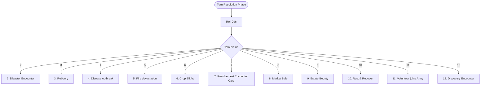

# Survival Mode: Fate Dice Mechanics Design Document

This document outlines the architecture, mechanics, probabilities, and catalogued outcomes for the **Fate Dice System** in *Abomination's* Survival Mode. The Fate Dice system simulates unexpected environmental events, financial crises, crop issues, faction opportunities, and alchemical breakthroughs at the end of each survival turn.

---

## 1. Fate Dice Core Loop

At the beginning of the turn resolution phase in Survival Mode, the game rolls two six-sided dice (2d6):
*   **Total Roll (2 - 12)**: Determines the category of event triggered.
*   **Left Die Roll (1 - 6)**: Acts as a dynamic severity/discount multiplier for specific outcomes.



---

## 2. Fate Dice Outcome Chart

The following table details the dynamic results resolved by the fate dice:

| Roll | Event Type | Description / Mechanics | Left Die Multiplier Effect |
| :--- | :--- | :--- | :--- |
| **2** | **Disaster** | Trigger a random disaster from the merged pool of generic disasters and active conditional disasters. | N/A |
| **3** | **Robbery** | Outlaws steal a percentage of the estate's cash reserves. | **Left Die = 2**: Lose 100% of money.<br>**Left Die = 1**: Lose 60% of money. |
| **4** | **Disease** | Outbreak depletes the team's initial momentum. | **-2 AP** at the start of the next combat encounter. |
| **5** | **Fire** | Fire spreads across resource stockpiles. | **Left Die = 4**: Lose 100% of metal.<br>**Left Die = 3**: Lose 60% of metal & 40% of wood.<br>**Left Die = 2**: Lose 40% of metal & 60% of wood.<br>**Left Die = 1**: Lose 100% of wood. |
| **6** | **Blight** | Fungal blight infects the food reserves. | **Left Die = 5**: Lose 90% of food.<br>**Left Die = 4**: Lose 75% of food.<br>**Left Die = 3**: Lose 60% of food.<br>**Left Die = 2**: Lose 45% of food.<br>**Left Die = 1**: Lose 30% of food. |
| **7** | **Encounter** | Resolve the next event card in the Canton travel deck. | N/A |
| **8** | **Sale** | Traveling merchants offer a discount on all market purchases this turn. | **Discount = Left Die * 10%** (e.g. Left Die is 6 yields a 60% discount). |
| **9** | **Bounty** | Soil fertility, animal breeding, and mining yields peak. | **Double all estate production** this turn. |
| **10** | **Rest** | Soldiers rest and recover energy. | **+2 AP** at the start of the next combat encounter. |
| **11** | **Volunteer** | A stray combatant offers their services to the estate. | A random combat card that the player does not have, with a level equivalent to the **mean level of the player's deck**, joins the army. If player card capacity is full, prompt to either refuse or discard a card. |
| **12** | **Discovery** | Trigger either an eligible **Conditional Discovery** or a **Generic Discovery**. | N/A |

---

## 3. Disaster Mechanics (Roll = 2)

When a **Disaster** is rolled:
*   The system compiles a list of all **Conditional Disasters** whose conditions are currently satisfied.
*   The pool of possible disasters is always **all Generic Disasters plus all currently eligible Conditional Disasters**.
*   The game selects **one disaster at random** from this merged pool. This prevents repeat loops of a single conditional disaster.

```
                          +-----------------------------------+
                          |        DISASTER SELECTION         |
                          +-----------------------------------+
                                            |
                                            v
                          +-----------------------------------+
                          |      Compile Eligible Pool:       |
                          |  [All 10 Generic Disasters] +     |
                          |  [Active Conditional Disasters]   |
                          +-----------------------------------+
                                            |
                                            v
                          +-----------------------------------+
                          |   Pick 1 Random Disaster from     |
                          |            merged pool            |
                          +-----------------------------------+
```

### A. 10 Generic Disasters (Always Eligible)
1.  **Faultline Rupture**: An earthquake strikes; one random purchased plot is lost (removed from `purchasedPlots`), destroying any building constructed on it.
2.  **Structural Conflagration**: A fire strikes the defensive towers; sets the damage status of 1 random tower in `towerDamaged` to `1.0` (destroyed), requiring repair.
3.  **Wasting Influenza**: Illness hits the barracks; resets all combat cards' progress towards their next experience level to 0 (e.g. card has 35/80 XP -> resets to 0/80 XP).
4.  **Corrosive Damp**: Moisture invades the storage yards; rots and removes **100% of stored wood resources**.
5.  **Acid Rain**: Corrosive rain compromises structural defenses; all three towers (`towerDamaged`) start the next combat with only **70% of their maximum health** (reduces current durability).
6.  **Rat Infestation**: Rats raid the larder; spoils **50% of food resources** and inflicts a "low morale" debuff to all cards in the deck, reducing their combat movement speed by 20% for the next battle.
7.  **Supply Cost Spike**: Economic inflation; doubles the cash cost of all building construction, upgrades, and tower repairs for the next 2 turns.
8.  **Broken Weapons**: Wear and tear on gear; a random combat unit's weapon is damaged, reducing their combat damage by 30% for the next 3 combat encounters.
9.  **Mental Melancholy**: Dark seasonal fog sets in; all combat units' AP is reduced by 2 for the next combat encounter.
10. **Alchemical Leak**: A toxic leak at the training grounds; all combat cards currently in `trainingUnitIds` take 50% health damage and are expelled from training.

### B. 20 Conditional Disasters
1.  **Munitions Factory Blowout**
    *   *Condition*: Player has a `munitionsFactory` building.
    *   *Effect*: The Munitions Factory is destroyed (removed from `buildings`), and a random combat card assigned as a worker there (`assignedUnitIds`) is permanently removed from the player's deck.
2.  **Zoonotic Farm Outbreak**
    *   *Condition*: Player has a `farm` building.
    *   *Effect*: Infection spreads among the crop workers; all combat cards currently assigned to work at the Farm (`assignedUnitIds`) have their current level experience progress reset to 0, and start the next combat with a **-50% health penalty**.
3.  **Glarus Peasant Border Raid**
    *   *Condition*: Faction standing with `Glarus` is < -10.
    *   *Effect*: Angry Glarus rebels raid the estate border; steals 50% of cash and sets the damage status of `tower_1` (or the first tower) to `1.0` (destroyed).
4.  **Royalist Trade Blockade**
    *   *Condition*: Faction standing with `Army` (Royalist faction) is < -10.
    *   *Effect*: The Royalists block trade paths; the player cannot purchase any cards or upgrades from the Weapon Market for 2 turns.
5.  **Carbonari Sabotage**
    *   *Condition*: Faction standing with `Carbonari` is < -10.
    *   *Effect*: Saboteurs blow up a facility; destroys 1 random constructed building (removes it from `buildings`).
6.  **Mine Shaft Collapse**
    *   *Condition*: Player has a `mine` building.
    *   *Effect*: A mine tunnel collapses; all combat units assigned as workers in the Mine (`assignedUnitIds`) are trapped and cannot be reassigned or participate in combat for the next 2 turns.
7.  **Lumber Mill Boiler Fire**
    *   *Condition*: Player has a `lumberMill` building.
    *   *Effect*: Boiler fire destroys the Lumber Mill (removed from `buildings`) and rots 50% of currently stored wood.
8.  **Arsenal Sabotage**
    *   *Condition*: Player has an `arsenal` building.
    *   *Effect*: Arsenal fire destroys the Arsenal (removed from `buildings`) and damages the weapons of all units assigned to it, applying the `bondageDebuffCount` +1 to each of them.
9.  **Garage Structural Damage**
    *   *Condition*: Player has a `garage` building.
    *   *Effect*: Heavy structural collapse damages the Garage, reducing its level by 1 (or destroying it if level 1) and disabling vehicle support cards for 2 turns.
10. **Crop Blight**
    *   *Condition*: Player has a `farm` building.
    *   *Effect*: Fungal blight consumes the crops, immediately removing **80% of current food reserves** and halting all farm food production for the next 2 turns.
11. **Starvation Insubordination**
    *   *Condition*: Any combat card has `starvationInfractions` >= 2.
    *   *Effect*: Hungry soldiers mutiny; they refuse to work or repair towers for the next turn, and steal 200 cash to buy food in the hamlet.
12. **Mine Water Seepage**
    *   *Condition*: Player has a `mine` building.
    *   *Effect*: Flooding halts mining; Mine produces 0 iron for 3 turns, and worker cards assigned there suffer a permanent 20% health debuff due to dampness.
13. **Wild Beast Raid**
    *   *Condition*: The player has no defensive walls or only damaged towers.
    *   *Effect*: Wild beasts raid the camp; kills 1 random worker unit that has a low level (level <= 2).
14. **Artillery Ammo Dampness**
    *   *Condition*: Player has an `arsenal` and an Artillery Barrage support card.
    *   *Effect*: Damp conditions ruin the munitions shells; the Artillery Barrage support card cannot be used in combat for the next 3 encounters.
15. **Training Accident**
    *   *Condition*: Player has at least 1 unit in `trainingUnitIds`.
    *   *Effect*: A live-fire accident injures 1 training unit; their training is cancelled, and they start the next combat with **10% health**.
16. **Lumber Mill Machine Failure**
    *   *Condition*: Player has a `lumberMill` building.
    *   *Effect*: Gear teeth break; the Lumber Mill's wood production is reduced by 50% for the next 4 turns.
17. **Tool Shed Theft**
    *   *Condition*: Cash is > 500.
    *   *Effect*: Thieves raid the workshop plots, stealing all tools; building repair costs are increased by 50% for the next 3 turns.
18. **Farmhand Exhaustion**
    *   *Condition*: Player has a `farm` with at least 2 workers assigned.
    *   *Effect*: Extreme physical fatigue; farm workers contract muscle strain, increasing their `bondageDebuffCount` by 1.
19. **Munitions Backfire**
    *   *Condition*: Player has a `munitionsFactory`.
    *   *Effect*: Nitroglycerin explodes; deals 50% damage to all watchtowers (`towerDamaged`).
20. **Canton Tax Levy**
    *   *Condition*: Faction standing with Glarus Canton is < 0.
    *   *Effect*: Canton levies a forced war tax, immediately deducting 400 CHF (or all cash if less).

---

## 5. Discovery Mechanics (Roll = 12)

When a **Discovery** is rolled, the system selects either an eligible **Conditional Discovery** or a **Generic Discovery**.
*   **Once Per Playthrough Constraint**: Every discovery is marked with a boolean flag when unlocked.
*   **Failed Redraw Rule**: If a previously unlocked discovery is drawn again, **no discovery is resolved** ("You discover nothing this turn"). The item is *not* removed from the deck pool, meaning the probability of finding a new discovery drops from 100% to 0% over time.

```
                          +-----------------------------------+
                          |        DISCOVERY DRAWN            |
                          +-----------------------------------+
                                            |
                                            v
                          +-----------------------------------+
                          |      Check if already unlocked    |
                          +-----------------------------------+
                                            |
                            +---------------+---------------+
                            |                               |
                            v                               v
            +-------------------------------+  +-------------------------------+
            |      Unlocked = False         |  |      Unlocked = True          |
            +-------------------------------+  +-------------------------------+
                            |                               |
                            v                               v
            +-------------------------------+  +-------------------------------+
            | Mark Unlocked & Resolve Event |  | "You discover nothing"        |
            +-------------------------------+  +-------------------------------+
```

### A. 20 Generic Discoveries (Always Eligible)
1.  **Lost Cashbox**: Unearth a vintage locked chest, yielding **+300 CHF**.
2.  **Ammunition Crate**: Find an abandoned munitions crate, yielding **+20 food** and **+50 metal**.
3.  **Abandoned Construction Pile**: Find a stockpile of bricks and planks, yielding **+150 wood** and **+50 metal**.
4.  **Weather Window**: Perfect skies boost solar/farm output, yielding **+100 food** and **+100 wood** next turn.
5.  **Wild Crop Seedlings**: Discover wild edible roots, yielding **+60 food**.
6.  **Draft Horse Recruit**: A lost draft horse wanders into camp, permanently reducing the wood cost of future facility construction by 10%.
7.  **Iron Ore Deposit**: Surface outcrop of iron found, yielding **+40 metal**.
8.  **Military Logbook**: Unearth an old tactical logbook; grants **+100 XP** to a random combat card in your deck.
9.  **Glarus Trade Voucher**: Find a canton voucher, yielding **+150 CHF** when redeemed.
10. **Aethelgard's Ring**: Discover a signet ring (+10 Standing with Glarus Canton).
11. **Fresh Water Spring**: Discover a clean spring; reduces the food consumption penalty of all units by 20% next turn.
12. **Merchant's Lost Ledger**: Grants a permanent **10% discount** on all card upgrades bought in the Weapon Market.
13. **Forgotten Gunpowder Stash**: Yields **+30 metal** and **+30 wood**.
14. **Migrating Waterfowl**: Catching birds yields **+80 food**.
15. **Forge Upgrades Crate**: Find casting tools, reducing the metal cost of the next tower upgrade by 25%.
16. **Surplus Medical Crate**: Recover field bandages, removing all accumulated `bondageDebuffCount` from all units in the deck.
17. **Inspiring Mountain Vista**: Clear weather boosts morale; all combat cards start the next combat with **+1 AP**.
18. **Iron Pickaxe Crate**: Yields **+50 metal**.
19. **Calming Herbage**: Cures the hunger/starvation infractions of 1 random unit (`starvationInfractions` reset to 0).
20. **Subterranean Cave Node**: Reveals a stable cave plot, adding **1 extra building plot** to your estate.

### B. 20 Conditional Discoveries
1.  **Glarus Canton Subsidy**
    *   *Condition*: Faction standing with `Glarus` is > 10.
    *   *Effect*: Glarus Canton sends a trade grant containing **+500 CHF**.
2.  **Carbonari Cache**
    *   *Condition*: Faction standing with `Carbonari` is > 10.
    *   *Effect*: Guerrillas share a weapon shipment, yielding **+100 metal** and **+50 wood**.
3.  **Army Reserve Supplies**
    *   *Condition*: Faction standing with `Army` is > 10.
    *   *Effect*: Army sends a logistics chest containing **+200 food** and **+50 metal**.
4.  **Deep Vein Silver Outcrop**
    *   *Condition*: Player has an active `mine` building.
    *   *Effect*: Miners strike a rich vein, yielding **+400 CHF** and **+50 metal**.
5.  **Greenhouse Thermal Synergy**
    *   *Condition*: Player has a `farm` building.
    *   *Effect*: High agricultural output yields **+200 food**.
6.  **Workshop Lathe Calibration**
    *   *Condition*: Player has a `lumberMill` building.
    *   *Effect*: Machine optimizations yield **+200 wood**.
7.  **Munitions Quality Control**
    *   *Condition*: Player has a `munitionsFactory` building.
    *   *Effect*: Quality checks yield **+100 metal** and grant +25 XP to all assigned factory workers.
8.  **Distillery Reserve Vintage**
    *   *Condition*: Player has an `arsenal` building.
    *   *Effect*: Refined tactical equipment increases the base damage of all watchtowers by +10% permanently.
9.  **Kitchen Culinary Mastery**
    *   *Condition*: Player has a `farm` building.
    *   *Effect*: Hearty meals cure 1 turn of starvation (`starvationInfractions` -1) for all combat cards.
10. **Library Cataloguing Method**
    *   *Condition*: Faction standing with the Royalists is > 10.
    *   *Effect*: Strategic guidance reduces the cash cost of all weapon upgrades by 15%.
11. **Double Chick Hatching**
    *   *Condition*: Player has a `farm` and current turn is >= 10.
    *   *Effect*: Bumper crop yield adds **+150 food**.
12. **Excavation Fossil Specimen**
    *   *Condition*: Player has a `mine` building.
    *   *Effect*: Sell an archaeological find for **+350 CHF**.
13. **Smoker Perfect Cure**
    *   *Condition*: Player has a `farm` and food is > 100.
    *   *Effect*: Smoked cures increase total food count by **+100**.
14. **Infirmary Sanitation Methods**
    *   *Condition*: Faction standing with `Army` is > 15.
    *   *Effect*: Battlefield sanitation removes all negative status effects from all combat units.
15. **Well Filtration System**
    *   *Condition*: Player has a `farm` building.
    *   *Effect*: Clean well water permanently increases the base health of all watchtowers by +10%.
16. **Brewery Canton Prize**
    *   *Condition*: Faction standing with Glarus Canton is > 15.
    *   *Effect*: Local trade award grants **+300 CHF** and **+50 food**.
17. **Artillery Alignment**
    *   *Condition*: Player has an `arsenal` building.
    *   *Effect*: Calibrated artillery scopes increase the base damage of the Artillery Barrage support card by +30% permanently.
18. **Faba Nitrogen Absorption**
    *   *Condition*: Player has a `farm` building.
    *   *Effect*: Smart rotation increases crop yield, adding **+100 food** and **+50 wood**.
19. **Basement Fungal Growth**
    *   *Condition*: Player has a `mine` building.
    *   *Effect*: Fungal harvest yields **+100 food**.
20. **Forge Blast Furnace Technique**
    *   *Condition*: Player has a `munitionsFactory` building.
    *   *Effect*: Steel refinements yield **+150 metal**.
