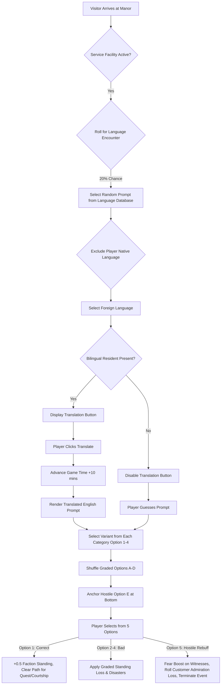

# Language Skills & Translation Mechanics Design Document

This design document outlines the implementation of multi-lingual customer interactions at the Manor. It introduces language barriers, resident translation capabilities, and graded customer satisfaction responses to test the player's linguistic awareness and resident skill integration.

---

## 1. Core Objective & Overview
When visitors arrive at the Manor seeking services (e.g., Crossroads Tavern, Restaurant, Infirmary/Dentist), they will occasionally present requests, questions, or demands in a foreign language (French, Italian, German, or Spanish). 

The player must resolve the encounter by choosing an appropriate response. To understand the prompt, they can utilize bilingual manor residents to translate, advancing the clock in exchange for clarity, or take a risk. They also possess a "hostile" reject option to force the customer away at a reputational cost.

---

## 2. Translation & Language Selection Logic

### A. The Language Pool
By default, the customer prompt is presented in one of the following foreign languages:
*   **French** (FR)
*   **Italian** (IT)
*   **German** (DE)
*   **Spanish** (ES)

### B. Dynamic Language Exclusions & Inclusions
The languages offered are adjusted dynamically based on the player's active interface language:
1.  **Exclude Native Language**: If the player is playing the game in French, Italian, German, or Spanish, encounters in that language are completely removed from the pool.
2.  **Include English**: If the player's interface is set to a language *other* than English, English is added to the pool of possible foreign customer languages.

### C. The Translation Action
If a customer speaks a foreign language:
1.  **Bilingual Resident Check**: The game checks if any resident currently present at the Manor has a trait or skill representing fluency in that language.
2.  **Translate Button**: If a fluent resident is present, a **"Translate"** button is displayed next to the text.
3.  **Cost**: Pressing "Translate" advances the game clock by **10 minutes**.
4.  **Effect**: The customer's text is translated into the player's active interface language (English by default).

---

## 3. Interaction Graded Responses & Outcomes

Every encounter displays **five options**. Options 1–4 represent response grades, while Option 5 represents a hostile denial.

### A. Response Options Graded Scale

All social standings and character attributes (Respect, Admiration, Fear) exist strictly within a **0.0 to 5.0** range. 
Each visitor is dynamically assigned to a specific **Faction** when they spawn. The game supports 11 distinct factions, and their spawn probabilities are weighted by the language of the encounter:

| Faction Name | French (FR) Weight | German (DE) Weight | English (EN) Weight | Italian (IT) Weight | Spanish (ES) Weight |
| :--- | :---: | :---: | :---: | :---: | :---: |
| **Glarus** | **40%** | 2.2% | 2.2% | 3% | 9.09% |
| **Chevaliers de la foi** | **40%** | 2.2% | 2.2% | 3% | 9.09% |
| **Gnomes of Zurich** | 2.2% | **40%** | 2.2% | 3% | 9.09% |
| **Rosicrucians** | 2.2% | **40%** | 2.2% | 3% | 9.09% |
| **Fenian Brotherhood** | 2.2% | 2.2% | **40%** | 3% | 9.09% |
| **Ancient Order of Foresters** | 2.2% | 2.2% | **40%** | 3% | 9.09% |
| **Carbonari** | 2.2% | 2.2% | 2.2% | **70%** | 9.09% |
| **Knights Templar** | 2.2% | 2.2% | 2.2% | 3% | 9.09% |
| **Golden Dawn** | 2.2% | 2.2% | 2.2% | 3% | 9.09% |
| **Freemasons** | 2.2% | 2.2% | 2.2% | 3% | 9.09% |
| **Army** | 2.2% | 2.2% | 2.2% | 3% | 9.09% |

*(Note: "Others" for each language are divided equally to sum to 100% total probability.)*

Graded outcomes adjust standings for the customer's *assigned faction* directly:

| Option Grade | Definition | Standing Influence | Gameplay Outcomes |
| :--- | :--- | :--- | :--- |
| **Option 1: Correct** | Clearly polite, accurate, and culturally appropriate response. | `+0.5` Faction Standing | Triggers positive customer experience; boosts relationship status; chance for new quest/contract, or triggers courtship spark. |
| **Option 2: Mildly Bad** | Slightly rude or incorrect but manageable. | `-0.2` Faction Standing | Minor inconvenience; small increase in room dirtiness, wasted time (+15 mins) or local fatigue. |
| **Option 3: Moderately Bad** | Highly offensive or incorrect. | `-0.5` Faction Standing, `-0.2` Respect | Major customer dissatisfaction; resets local customer mood; small chance of a minor threat check. |
| **Option 4: Catastrophic** | Extremely hostile, dangerous, or fatal mistake. | `-1.0` Faction Standing, `-1.0` Admiration | Triggers immediate local combat encounter, lawsuit threat, or physical damages to watchtowers/facilities. |

### B. Option 5: Hostile Rebuff
The fifth option is always: **"We don't serve your kind here."** (Always rendered in English).

Choosing this option causes the following immediate effects:
1.  **Ends Encounter**: The customer is turned away immediately, ending the encounter. The player bypasses the risk of selecting a catastrophic response.
2.  **Hostile Label**: Counts as a Hostile Action.
3.  **Witness Intimidation**: NPCs nearby (witnesses) register this action:
    *   *Scary/Intimidating*: Observers gain a temporary increase in **Fear** (`+0.5`) but suffer a loss in **Admiration** (`-0.2`).
4.  **Customer Admiration Loss Checks**: The customer's standing toward the player/manor is rolled:
    *   **30% Chance**: No admiration loss, but a minor **Respect** loss (`-0.8`).
    *   **40% Chance**: Small **Admiration** loss (`-1.0`).
    *   **30% Chance**: Large **Admiration** loss (`-2.0`).

### C. Options Presentation Shuffling & Random Variant Selection
To ensure gameplay variety and prevent simple pattern memorization:
1.  **Multiple Option Variants**: Each interaction category (Correct, Mildly Bad, Moderately Bad, Catastrophic) contains multiple wording variations showing different levels of language mastery (e.g., formal English vs. broken/simplified translations or completely off-topic insults).
2.  **Dynamic Selection**: When generating the interaction dialog, the game randomly selects **one** variant from the pool for each of the four categories.
3.  **Shuffle Graded Options**: Prior to displaying the dialog, the four selected options must be completely randomized (shuffled) in order (Options A, B, C, D).
4.  **Anchor Option 5**: Option 5 ("We don't serve your kind here") must *never* be shuffled and must always be appended statically as the final (5th) choice at the bottom of the list.

---

## 4. Encounter Catalogue & Candidate Options Database

Below is the database of visitor encounters, including translations, candidate options, and specific outcomes:

### A. Generic Customer Interactions

#### 1. Restroom Query
*   **English**: "Excuse me, where is the restroom?"
*   **French**: "Excusez-moi, où sont les toilettes?"
*   **Italian**: "Scusi, dov'è il bagno?"
*   **German**: "Entschuldigung, wo ist die Toilette?"
*   **Spanish**: "¿Disculpe, dónde está el baño?"
*   *Option 1 (Correct)*:
    *   **Variant A (Formal)**: "Go down the main hall and take the first door on your left."
    *   **Variant B (Simple)**: "First door on the left, down the corridor."
    *   *Effect*: `+0.5` Faction Standing.
*   *Option 2 (Mildly Bad)*:
    *   **Variant A (Confusing)**: "I think there is one somewhere in the backyard, or maybe the kitchen?"
    *   **Variant B (Vague)**: "Somewhere upstairs. Just walk around until you find a door."
    *   *Effect*: `-0.2` Faction Standing, clock advances +10 minutes, kitchen dirtiness increases by `+0.1` as the customer wanders.
*   *Option 3 (Moderately Bad)*:
    *   **Variant A (Impolite)**: "Just use the nearest bush outside. We do not have public facilities."
    *   **Variant B (Non-sequitur)**: "Clean teeth? No, we do not brush here. Go away."
    *   *Effect*: `-0.5` Faction Standing, `-0.2` Respect. Customer leaves insulted.
*   *Option 4 (Catastrophic)*:
    *   **Variant A (Dangerous)**: "The cellar is open, just relieve yourself down there next to the alchemical jars."
    *   **Variant B (Short/Broken)**: "Downstairs. Open door." (Customer enters cellar thinking it's the bathroom, is horrified by alchemical experiments and breaks equipment, losing 100 CHF).
    *   *Effect*: `-1.0` Faction Standing.

#### 2. Closing Time
*   **English**: "What time do you close?"
*   **French**: "À quelle heure fermez-vous?"
*   **Italian**: "A che ora chiudete?"
*   **German**: "Um wie viel Uhr schließen Sie?"
*   **Spanish**: "¿A qué hora cierran?"
*   *Option 1 (Correct)*:
    *   **Variant A (Formal)**: "We close at ten o'clock in the evening, but you are welcome to stay until then."
    *   **Variant B (Simple)**: "Ten o'clock tonight."
    *   *Effect*: `+0.5` Faction Standing.
*   *Option 2 (Mildly Bad)*:
    *   **Variant A (Confusing)**: "Usually we close whenever we feel like it. Maybe in an hour?"
    *   **Variant B (Vague)**: "Soon, probably. Or later. Depending on the moon."
    *   *Effect*: `-0.2` Faction Standing.
*   *Option 3 (Moderately Bad)*:
    *   **Variant A (Impolite)**: "Why do you care? Just buy your things and leave."
    *   **Variant B (Non-sequitur)**: "Yes, we sell fine local potatoes. Two coins a pound."
    *   *Effect*: `-0.5` Faction Standing, `-0.2` Respect.
*   *Option 4 (Catastrophic)*:
    *   **Variant A (Hostile)**: "We closed an hour ago. You are trespassing right now!"
    *   **Variant B (Insult)**: "We closed for dirty peasants like you long ago. Get off my lawn!"
    *   *Effect*: `-1.0` Faction Standing, `-1.0` Admiration. Customer alerts local authorities (triggers minor threat check).

#### 3. Open Status
*   **English**: "Are you open right now?"
*   **French**: "Êtes-vous ouvert actuellement?"
*   **Italian**: "Siete aperti in questo momento?"
*   **German**: "Haben Sie gerade geöffnet?"
*   **Spanish**: "¿Están abiertos ahora mismo?"
*   *Option 1 (Correct)*:
    *   **Variant A (Formal)**: "Yes, we are open and ready to serve you. Please come in!"
    *   **Variant B (Simple)**: "Yes, come in!"
    *   *Effect*: `+0.5` Faction Standing.
*   *Option 2 (Mildly Bad)*:
    *   **Variant A (Vague)**: "Well, the doors are unlocked, so I guess we are open."
    *   **Variant B (Slightly Broken)**: "Door open. You enter, maybe? We do stuff."
    *   *Effect*: `-0.2` Faction Standing.
*   *Option 3 (Moderately Bad)*:
    *   **Variant A (Impolite)**: "No, but you can stand outside in the rain and wait."
    *   **Variant B (Non-sequitur)**: "Bananas are yellow. Do you like bananas?"
    *   *Effect*: `-0.5` Faction Standing.
*   *Option 4 (Catastrophic)*:
    *   **Variant A (Hostile)**: "Open? No, this is a restricted zone! Guards, seize this spy!"
    *   **Variant B (Accidental Warning)**: "We only open to drain the blood of travellers. Enter!"
    *   *Effect*: `-1.0` Faction Standing. Triggers combat with 1 local faction rebel.

#### 4. Direction to Town
*   **English**: "How do I get to town from here?"
*   **French**: "Comment aller en ville depuis d'ici?"
*   **Italian**: "Come arrivo in città da qui?"
*   **German**: "Wie komme ich von hier aus in die Stadt?"
*   **Spanish**: "¿Cómo se va al pueblo desde aquí?"
*   *Option 1 (Correct)*:
    *   **Variant A (Formal)**: "Follow the main dirt road east for two miles, you can't miss it."
    *   **Variant B (Simple)**: "Take dirt road east. Two miles straight."
    *   *Effect*: `+0.5` Faction Standing.
*   *Option 2 (Mildly Bad)*:
    *   **Variant A (Confusing)**: "Just head towards the sunrise. It's somewhere out that way."
    *   **Variant B (Vague)**: "Walk past the big tree, then turn where the old cow died."
    *   *Effect*: `-0.2` Faction Standing. Customer gets lost, wasting 20 minutes.
*   *Option 3 (Moderately Bad)*:
    *   **Variant A (Dangerous Shortcut)**: "Go through the Glarus forest path at night. It's a shortcut."
    *   **Variant B (Non-sequitur)**: "Town is boring. Stay here and drink raw alcohol instead."
    *   *Effect*: `-0.5` Faction Standing. Customer gets attacked by wolves or goes home annoyed.
*   *Option 4 (Catastrophic)*:
    *   **Variant A (Dangerous)**: "Walk straight through the militarized watchtower lane without showing papers."
    *   **Variant B (Short/Broken)**: "Go lane. Don't stop." (Customer is fired upon by watchtower guards, causing Canton standing to drop by `-1.5`).
    *   *Effect*: `-1.0` Faction Standing.

#### 5. Manager Escalation
*   **English**: "I would like to speak with the manager!"
*   **French**: "Je voudrais parler au responsable!"
*   **Italian**: "Vorrei parlare con il manager!"
*   **German**: "Ich möchte mit dem Geschäftsführer sprechen!"
*   **Spanish**: "¡Me gustaría hablar con el gerente!"
*   *Option 1 (Correct)*:
    *   **Variant A (Formal)**: "I am the Master of the manor. How can I help resolve your issue?"
    *   **Variant B (Simple)**: "I am in charge. What is wrong?"
    *   *Effect*: `+0.5` Faction Standing.
*   *Option 2 (Mildly Bad)*:
    *   **Variant A (Vague)**: "The manager is currently dissecting a specimen. You can wait a couple of hours."
    *   **Variant B (Broken)**: "Boss busy cutting meat. Wait or go."
    *   *Effect*: `-0.2` Faction Standing.
*   *Option 3 (Moderately Bad)*:
    *   **Variant A (Impolite)**: "There is no manager. I run this place, and I say your complaint is invalid."
    *   **Variant B (Non-sequitur)**: "Manager? We only sell cabbage. Want cabbage?"
    *   *Effect*: `-0.5` Faction Standing, `-0.2` Respect.
*   *Option 4 (Catastrophic)*:
    *   **Variant A (Threat)**: "You want a manager? Let me introduce you to my flesh golem. He handles customer service."
    *   **Variant B (Insult)**: "Idiots like you don't deserve manager attention. Get out before I test my poisons on you."
    *   *Effect*: `-1.0` Faction Standing, `-1.0` Admiration. Nearby witnesses gain `+1.0` Fear.

#### 6. Business Tenure
*   **English**: "How long have you been in business?"
*   **French**: "Depuis combien de temps êtes-vous en activité?"
*   **Italian**: "Da quanto tempo siete in attività?"
*   **German**: "Wie lange sind Sie schon im Geschäft?"
*   **Spanish**: "¿Cuánto tiempo llevan en el negocio?"
*   *Option 1 (Correct)*:
    *   **Variant A (Formal)**: "Our family estate has served this Canton for over three generations."
    *   **Variant B (Simple)**: "Three generations in Glarus."
    *   *Effect*: `+0.5` Faction Standing.
*   *Option 2 (Mildly Bad)*:
    *   **Variant A (Vague)**: "A few years, I think. Time blends together in the laboratory."
    *   **Variant B (Broken)**: "We here since some years. I do not count days."
    *   *Effect*: `-0.2` Faction Standing.
*   *Option 3 (Moderately Bad)*:
    *   **Variant A (Impolite)**: "None of your business. We don't keep records for nosey strangers."
    *   **Variant B (Non-sequitur)**: "We opened at seven. Breakfast is done."
    *   *Effect*: `-0.5` Faction Standing, `-0.2` Respect.
*   *Option 4 (Catastrophic)*:
    *   **Variant A (Suspicious)**: "Since before the outbreak. Back when we didn't have to hide the bodies."
    *   **Variant B (Accidental Admission)**: "Since the government allowed us to experiment on the local orphans."
    *   *Effect*: `-1.0` Faction Standing, `-1.0` Admiration. Triggers local Canton investigation.

#### 7. Restaurant Recommendations
*   **English**: "Do you know anywhere good to eat around here?"
*   **French**: "Connaissez-vous un bon endroit pour manger par ici?"
*   **Italian**: "Conosce un buon posto dove mangiare qui vicino?"
*   **German**: "Kennen Sie hier in der Nähe ein gutes Restaurant?"
*   **Spanish**: "¿Conoce algún buen lugar para comer por aquí?"
*   *Option 1 (Correct)*:
    *   **Variant A (Formal)**: "Our own Manor Dining Hall serves the finest local cuisine in the Canton."
    *   **Variant B (Simple)**: "Eat here! Our Dining Hall is excellent."
    *   *Effect*: `+0.5` Faction Standing. Customer enters dining hall, spending +50 CHF.
*   *Option 2 (Mildly Bad)*:
    *   **Variant A (Confusing)**: "The tavern down the road has some decent bread and cheap beer."
    *   **Variant B (Vague)**: "Try town. Some places have food, if the rats haven't eaten it."
    *   *Effect*: `-0.2` Faction Standing.
*   *Option 3 (Moderately Bad)*:
    *   **Variant A (Impolite)**: "I heard the local soldiers eat wild crows. Maybe try that?"
    *   **Variant B (Non-sequitur)**: "Eating is a weakness of the biological flesh. Purge it."
    *   *Effect*: `-0.5` Faction Standing.
*   *Option 4 (Catastrophic)*:
    *   **Variant A (Dangerous)**: "Eat? The alchemical waste dump has some glowing mushrooms that look delicious."
    *   **Variant B (Broken/Short)**: "Mushrooms in cellar. Eat." (Customer eats toxic experimental fungus, gets poisoned, costing 150 CHF in medical lawsuits).
    *   *Effect*: `-1.0` Faction Standing, `-1.0` Admiration.

#### 8. Warranty Spam (Humorous)
*   **English**: "Do you have a moment to talk about your car’s extended warranty?"
*   **French**: "Avez-vous un moment pour parler de la garantie prolongée de votre véhicule?"
*   **Italian**: "Ha un momento per parlare della garanzia estesa della sua auto?"
*   **German**: "Haben Sie einen Moment Zeit, um über die verlängerte Garantie Ihres Autos zu sprechen?"
*   **Spanish**: "¿Tiene un momento para hablar sobre la garantía extendida de su auto?"
*   *Option 1 (Correct)*:
    *   **Variant A (Formal)**: "We only operate wooden steam-carriages here, so we must decline your offer."
    *   **Variant B (Simple)**: "We do not own cars. Good day."
    *   *Effect*: `+0.5` Faction Standing. Customer leaves.
*   *Option 2 (Mildly Bad)*:
    *   **Variant A (Confusing)**: "What is a 'car'? Is this some new alchemical engine?"
    *   **Variant B (Vague)**: "Tell me more about this warranty. Does it cover dragon attacks?"
    *   *Effect*: `-0.2` Faction Standing. Customer wastes 15 minutes of your time.
*   *Option 3 (Moderately Bad)*:
    *   **Variant A (Impolite)**: "I am going to cast a spell on you if you don't step off my porch."
    *   **Variant B (Non-sequitur)**: "My teeth are clean. Go away, dentist."
    *   *Effect*: `-0.5` Faction Standing.
*   *Option 4 (Catastrophic)*:
    *   **Variant A (Scammed)**: "I will sign up! Here is my signature and 400 CHF in gold coins."
    *   **Variant B (Broken/Short)**: "Yes, take money. Write papers."
    *   *Effect*: `-1.0` Faction Standing. Automatically deducts 400 CHF.

#### 9. Wait Time
*   **English**: "How long is the wait?"
*   **French**: "Combien de temps faut-il attendre?"
*   **Italian**: "Quanto tempo c'è da aspettare?"
*   **German**: "Wie lange ist die Wartezeit?"
*   **Spanish**: "¿Cuánto dura la espera?"
*   *Option 1 (Correct)*:
    *   **Variant A (Formal)**: "It should be no longer than ten minutes. Please make yourself comfortable."
    *   **Variant B (Simple)**: "Ten minutes. Sit down, please."
    *   *Effect*: `+0.5` Faction Standing.
*   *Option 2 (Mildly Bad)*:
    *   **Variant A (Confusing)**: "Maybe twenty minutes, maybe an hour. We are very busy today."
    *   **Variant B (Vague)**: "Some time. Depending on how many people die inside first."
    *   *Effect*: `-0.2` Faction Standing.
*   *Option 3 (Moderately Bad)*:
    *   **Variant A (Impolite)**: "It takes as long as it takes. Stop asking."
    *   **Variant B (Non-sequitur)**: "We don't take reservations. Stand outside."
    *   *Effect*: `-0.5` Faction Standing, `-0.2` Respect.
*   *Option 4 (Catastrophic)*:
    *   **Variant A (Threat)**: "The wait is indefinite. Actually, we are selecting volunteers for human experimentation now!"
    *   **Variant B (Insult)**: "Wait forever, you dog! Your face is offending my eyes."
    *   *Effect*: `-1.0` Faction Standing, `-1.0` Admiration. Customer flees in terror, spreading panic.

#### 10. Bible Preachers
*   **English**: "We're just stopping by for a few minutes to share a positive, encouraging thought from the Bible with our neighbors."
*   **French**: "Nous passons juste quelques minutes pour partager une pensée positive et encourageante de la Bible avec nos voisins."
*   **Italian**: "Ci fermiamo solo per pochi minuti per condividere un pensiero positivo e incoraggiante della Bibbia con i nostri vicini."
*   **German**: "Wir schauen nur kurz vorbei, um einen positiven, ermutigenden Gedanken aus der Bibel mit unseren Nachbarn zu teilen."
*   **Spanish**: "Sólo pasamos unos minutos para compartir un pensamiento positivo y alentador de la Biblia con nuestros vecinos."
*   *Option 1 (Correct)*:
    *   **Variant A (Formal)**: "Thank you for your blessings. Have a peaceful day on your travels."
    *   **Variant B (Simple)**: "Thank you. Blessings on your journey."
    *   *Effect*: `+0.5` Faction Standing.
*   *Option 2 (Mildly Bad)*:
    *   **Variant A (Vague)**: "We are busy with scientific work, but thank you anyway."
    *   **Variant B (Broken)**: "No bible. We do research. Go away but nicely."
    *   *Effect*: `-0.2` Glarus Standing.
*   *Option 3 (Moderately Bad)*:
    *   **Variant A (Impolite)**: "Keep your holy texts away from my manor. We worship logic and science here."
    *   **Variant B (Non-sequitur)**: "No, the restrooms are closed. Use the grass."
    *   *Effect*: `-0.5` Faction Standing, `-0.2` Respect.
*   *Option 4 (Catastrophic)*:
    *   **Variant A (Hostile)**: "Heretics! Release the undead bats to cleanse this holy nuisance!"
    *   **Variant B (Insult)**: "Your god is dead and my creations will consume your souls. Die!"
    *   *Effect*: `-1.0` Faction Standing. Triggers combat with 2 zealous missionaries.

---

### B. Business-Specific Customer Interactions

#### 1. Room Rental (Tavern / Hotel)
*   **English**: "Is it possible to rent a room?"
*   **French**: "Est-il possible de louer une chambre?"
*   **Italian**: "È possibile affittare una camera?"
*   **German**: "Kann man hier ein Zimmer mieten?"
*   **Spanish**: "¿Es possibile alquilar una habitación?"
*   *Option 1 (Correct)*:
    *   **Variant A (Formal)**: "Yes, we have clean rooms available in the Guest Wing for 40 CHF a night."
    *   **Variant B (Simple)**: "Yes, rooms are 40 CHF. Guest wing."
    *   *Effect*: `+0.5` Faction Standing, gain +40 CHF.
*   *Option 2 (Mildly Bad)*:
    *   **Variant A (Vague)**: "We have an old closet in the servants quarters if you don't mind the rats."
    *   **Variant B (Broken)**: "Maybe a bed. Servants room. Rats are free."
    *   *Effect*: `-0.2` Faction Standing.
*   *Option 3 (Moderately Bad)*:
    *   **Variant A (Impolite)**: "Rent? No, we only house members of the secret societies."
    *   **Variant B (Non-sequitur)**: "I do not know. Go ask the horse in the stable."
    *   *Effect*: `-0.5` Faction Standing.
*   *Option 4 (Catastrophic)*:
    *   **Variant A (Dangerous)**: "We only rent rooms to those willing to sleep in the dissection laboratory."
    *   **Variant B (Insult)**: "We do not rent to trash like you. Go sleep in the manure pile!"
    *   *Effect*: `-1.0` Faction Standing, `-1.0` Admiration.

#### 2. Clinic Emergency (Infirmary)
*   **English**: "My father is having a medical emergency!"
*   **French**: "Mon père a une urgence médicale!"
*   **Italian**: "Mio padre ha un'emergenza medica!"
*   **German**: "Mein Vater hat einen medizinischen Notfall!"
*   **Spanish**: "¡Mi padre tiene una emergencia médica!"
*   *Option 1 (Correct)*:
    *   **Variant A (Formal)**: "Bring him to the Infirmary immediately. I will fetch the physician."
    *   **Variant B (Simple)**: "Infirmary is open. Bring him inside now."
    *   *Effect*: `+0.5` Faction Standing. Triggers emergency quest.
*   *Option 2 (Mildly Bad)*:
    *   **Variant A (Vague)**: "Fill out these intake documents first, then wait in the queue."
    *   **Variant B (Broken)**: "Paperwork first. Name, age, blood type. Write it down."
    *   *Effect*: `-0.2` Faction Standing.
*   *Option 3 (Moderately Bad)*:
    *   **Variant A (Impolite)**: "We don't treat non-residents. Try the apothecary in town."
    *   **Variant B (Non-sequitur)**: "Have you tried giving him warm beer? It cures most fevers."
    *   *Effect*: `-0.5` Faction Standing.
*   *Option 4 (Catastrophic)*:
    *   **Variant A (Threat)**: "A medical emergency? Perfect, we need fresh organs for our next golem construction!"
    *   **Variant B (Insult)**: "Let him die. It saves us the trouble of burying him."
    *   *Effect*: `-1.0` Faction Standing, `-1.0` Admiration. Triggers lawsuit threat.

#### 3. Sickness (Dentistry / Outbreak Ward)
*   **English**: "I’ve been coughing up blood, is it alright if I come in?"
*   **French**: "Je crache du sang, puis-je entrer?"
*   **Italian**: "Ho sputato sangue, posso entrare?"
*   **German**: "Ich habe Blut gehustet, darf ich reinkommen?"
*   **Spanish**: "He estado tosiendo sangre, ¿está bien si entro?"
*   *Option 1 (Correct)*:
    *   **Variant A (Formal)**: "Please enter the quarantine ward immediately so we can treat your lungs safely."
    *   **Variant B (Simple)**: "Quarantine ward. Enter quickly."
    *   *Effect*: `+0.5` Faction Standing.
*   *Option 2 (Mildly Bad)*:
    *   **Variant A (Confusing)**: "Coughing blood? Try drinking some warm tea with honey first."
    *   **Variant B (Vague)**: "Drink vinegar. It stops the bleeding, sometimes."
    *   *Effect*: `-0.2` Faction Standing.
*   *Option 3 (Moderately Bad)*:
    *   **Variant A (Impolite)**: "Stay away! You are going to infect the entire estate! Go back to the valley."
    *   **Variant B (Non-sequitur)**: "My teeth are fine, thank you. Go see the barber."
    *   *Effect*: `-0.5` Faction Standing.
*   *Option 4 (Catastrophic)*:
    *   **Variant A (Dangerous)**: "No problem, just sit in the main dining hall next to the kitchen prep table."
    *   **Variant B (Broken/Short)**: "Sit in dining room. Eat soup." (Sickness spreads, infecting the kitchen staff, causing disease outbreak).
    *   *Effect*: `-1.0` Faction Standing.

#### 4. Reservations (Dining Hall)
*   **English**: "Do you take reservations?"
*   **French**: "Prenez-vous des réservations?"
*   **Italian**: "Accettate prenotazioni?"
*   **German**: "Nehmen Sie Reservierungen an?"
*   **Spanish**: "¿Aceptan reservas?"
*   *Option 1 (Correct)*:
    *   **Variant A (Formal)**: "Yes, we can reserve a private table for your party. For what time?"
    *   **Variant B (Simple)**: "Yes. Table for how many?"
    *   *Effect*: `+0.5` Faction Standing.
*   *Option 2 (Mildly Bad)*:
    *   **Variant A (Confusing)**: "Only if you pay a reservation deposit of 20 CHF upfront."
    *   **Variant B (Vague)**: "Maybe, if we have tables. We are very popular, you know."
    *   *Effect*: `-0.2` Faction Standing.
*   *Option 3 (Moderately Bad)*:
    *   **Variant A (Impolite)**: "No reservations. You line up outside like everyone else."
    *   **Variant B (Non-sequitur)**: "We only cook potatoes. No seats, just potatoes."
    *   *Effect*: `-0.5` Faction Standing.
*   *Option 4 (Catastrophic)*:
    *   **Variant A (Classist)**: "Reservations are reserved for nobility. Peasants are not allowed to book tables."
    *   **Variant B (Insult)**: "We don't take bookings for pigs. Go eat in the mud!"
    *   *Effect*: `-1.0` Faction Standing, `-1.0` Respect (from Glarus peasants).

#### 5. Distributor (Distillery)
*   **English**: "Are you happy with your present liquor distributor?"
*   **French**: "Êtes-vous satisfait de votre distributeur d'alcool actuel?"
*   **Italian**: "È soddisfatto del suo attuale distributore di alcolici?"
*   **German**: "Sind Sie mit Ihrem aktuellen Spirituosen-Händler zufrieden?"
*   **Spanish**: "¿Está contento con su actual distribuidor de licores?"
*   *Option 1 (Correct)*:
    *   **Variant A (Formal)**: "We distill our own high-quality spirits, but we are open to reviewing raw ingredient offers."
    *   **Variant B (Simple)**: "We make our own. But we buy yeast/grain."
    *   *Effect*: `+0.5` Faction Standing. Triggers raw trade agreement quest.
*   *Option 2 (Mildly Bad)*:
    *   **Variant A (Confusing)**: "Yes, our current supplier is fine. We don't need changes."
    *   **Variant B (Vague)**: "Maybe. Bring a sample of your gin, and we will talk later."
    *   *Effect*: `-0.2` Faction Standing.
*   *Option 3 (Moderately Bad)*:
    *   **Variant A (Impolite)**: "Your distributor prices are probably a scam anyway. Leave us alone."
    *   **Variant B (Non-sequitur)**: "No, we only drink milk here. Milk is pure."
    *   *Effect*: `-0.5` Faction Standing.
*   *Option 4 (Catastrophic)*:
    *   **Variant A (Illegal)**: "We only buy illegal black-market spirits, are you selling those?"
    *   **Variant B (Threat)**: "If you try to sell me your cheap poison again, I will lock you in the cellar with the rats."
    *   *Effect*: `-1.0` Faction Standing. Triggers police inspection.

---

## 5. Integration Architecture & State Flow

### A. State Variables
We will expand the player state to track:
*   `progress.cardUpgrades['glarus_translator_level']`: tracks translation speed/accuracy.
*   `progress.factionStandings['Language_Spoken']`: standing adjustments for multi-lingual customers.

### B. UI Mockup Design
The dialog overlay displays a parchmented card style:
1.  **Header**: "FOREIGN CUSTOMER INQUIRY"
2.  **Subheader**: The customer's name and associated language (e.g. *Italian speaker*).
3.  **Prompt Area**: Shows text in foreign language (e.g. *"Scusi, dov'è il bagno?"*).
4.  **Translation Actions**: 
    *   `[TRANSLATE (10 Mins)]` (active only if a bilingual resident is assigned/present at the manor).
5.  **Response Selector**:
    *   Option A, B, C, D (Randomly Shuffled Variants of Options 1–4)
    *   Option E: `"We don't serve your kind here."` (Anchored statically at the bottom)
