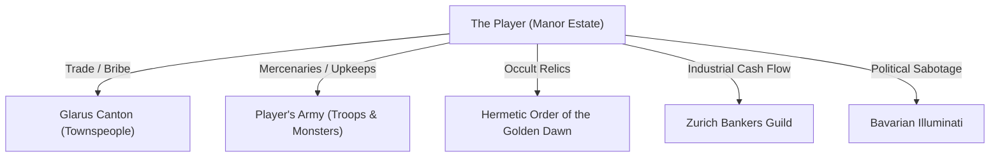
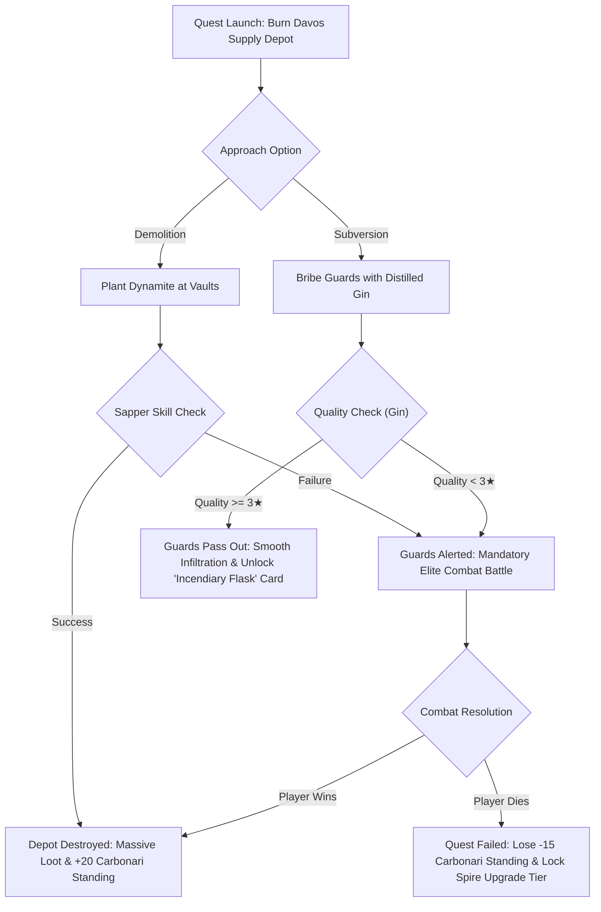
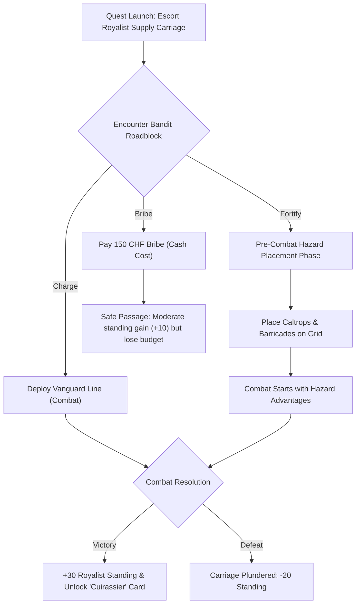

# Quest, Faction, & Culinary Design Document

This document defines the faction quest lines, the mechanical design of the adjacent proficiency system, and the culinary recipe pipelines for *Abomination*.

---

## 1. Lore & Factions

The game features several factions, secret societies, and entities vying for control over rural Switzerland in the 1860s. Players engage with these groups through strategic quests, trades, and experimental decisions.

### Major Factions

| Faction | Philosophy & Themes | Wants & Needs | Dislikes | Player Synergy & Unlocks |
| :--- | :--- | :--- | :--- | :--- |
| **Carbonari** | Anarchist revolution, subversion, structural demolition, fire and ash. | High-potency spirits (Gin, Absinthe), gunpowder, sabotage. | Royalist authority, police presence, resource hoarding. | Demolition speed, raw attack boosts, active saboteur cards (Incendiaries). |
| **Royalists** | Imperial crown loyalty, defensive blockades, military order. | High defense walls, iron supply, weapons, order. | Anarchist activity, riots, lawlessness. | Fortress defense, watchtower cost reductions, unit armor buffs. |
| **Masons** | Forbidden geometry, secret architecture, sapping, occult engineering. | Stone, ancient relics, mathematical solutions. | Unsanctioned construction, chaotic designs. | Research puzzle shortcuts, room construction speed, AP boosts. |
| **Foresters** | Nature restoration, wildwood beast control, herbal medicine. | Rare herbs, monster specimens, animal hides. | Heavy machinery, industrial pollution, deforestation. | Poison immunities, potion potency, passive agriculture yields. |

### Secret Societies & Local Entities



#### 1. Glarus Canton (Local Government & Townspeople)
*   **Philosophy**: Preservation of local peace, traditional farming, safety from monsters.
*   **Wants & Needs**: Fresh food supply (Spelt Bread, Stews), security from bandit attacks, low experimental "leakage" (escaping monstrosities).
*   **Dislikes**: Laboratory explosions, mysterious disappearances, toxic gas clouds drifting from the manor.
*   **Missions / Decisions**:
    *   *The Harvest Crisis*: Glarus demands a donation of 100 Spelt Breads to survive the winter. Succeeding yields high goodwill and lower prices in the Hamlet.
    *   *The Beast in the Woods*: Townspeople report a mutated wolf (player's escaped experiment). The player must choose to hunt it (gaining Glarus trust) or recapture it secretly (retaining the experiment but risking suspicion).

#### 2. Player's Army (Mercenaries, Slayers, and Reanimated Monsters)
*   **Philosophy**: Tactical efficiency, survival on the battlefield, self-preservation.
*   **Wants & Needs**: regular food rations (stews/cider), timely payroll (CHF), high-quality equipment, reanimation energy.
*   **Dislikes**: High casualty rates, starvation (leads to mutiny or feral behavior in monsters), lack of combat support.
*   **Missions / Decisions**:
    *   *The Mercenary Strike*: Soldiers refuse to deploy unless paid an immediate 100 CHF bonus or fed high-sophistication meals (e.g., Lasagna al Forno) to boost morale.
    *   *Unstable Chimera*: A high-level monster requires constant fresh meat feeding. If neglected, it will attack other soldiers in the barracks.

#### 3. Hermetic Order of the Golden Dawn (Secret Occult Society)
*   **Philosophy**: Transcendence, alchemy, ancient symbolism, and dark reanimation secrets.
*   **Wants & Needs**: Absinthe, ancient alchemical scripts, rare specimens (Werewolves, Chimeras).
*   **Dislikes**: Materialistic banking guilds, simple physical science.
*   **Player Synergy**: Unlocks forbidden research lines, occult abilities for the player character, and reanimation efficiency.

#### 4. Zurich Bankers Guild (Financial Elites)
*   **Philosophy**: Industrial expansion, capital accumulation, and global monetary leverage.
*   **Wants & Needs**: High-value distilled spirits (Brandy exports), gold assets, secured carriage routes.
*   **Dislikes**: Disruptions to trade, anarchists (Carbonari), defaulted loans.
*   **Player Synergy**: Lowers loan interest rates, unlocks advanced machinery purchases (Gatling Guns, Armored Cars).

#### 5. Bavarian Illuminati (Secret Political Saboteurs)
*   **Philosophy**: Scientific enlightenment, dismantling of old monarchies, global manipulation.
*   **Wants & Needs**: Secret files (Manor Records), biological weapons (Tear Gas).
*   **Dislikes**: Religious authority, traditional aristocracy (Royalists).
*   **Player Synergy**: Intel reports on upcoming enemy attack layouts, unlocks advanced infiltration tactics.

---

## 2. Faction Quest Decision Trees & Pre-Combat Placement Mechanics

### Quest Decision Trees

#### Carbonari: "The Great Conflagration"


#### Royalists: "The Geneva Convoy"


### Pre-Combat Hazard Placement Mechanics
In the **Royalists: "The Geneva Convoy"** quest, choosing the **Fortify** route initiates an interactive **Pre-Combat Placement Phase**:
1.  **Grid Overlay**: Before units deploy and the timer starts, the battlefield loads in a paused "Tactical Preparation" state.
2.  **Hazard Stock**: The player accesses a construction drawer containing:
    *   **Wooden Barricades** (Max 2): Blocks physical movement. Enemies must attack and destroy the barricade (500 HP) or route around it if another lane is open.
    *   **Caltrop Spikes** (Max 3): Ground hazards. Deployed across a 15ft radius circle. Enemies walking over them take 20 piercing damage and suffer a persistent -40% speed penalty for 6 seconds.
3.  **Active Placement**: The player taps and drags these hazards directly onto the lane grids. This permits bottlenecking opponents, protecting the vulnerable Royalist supply carriage trailing behind the front line.

---

## 3. Adjacent Proficiencies Mechanical Design

To model realistic culinary mastery, kitchen activities are organized under the **Adjacent Proficiencies System**.

```
                   [ Generic Core: COOKING ]
                               |
       +-----------+-----------+-----------+-----------+
       |           |                       |           |
 [ BAKING ]   [ GRILLING ]           [ BREWING ]  [ DISTILLING ]
```

### Proficiency Attribute Mapping:
Culinary excellence is built on a spectrum of character traits rather than simple strength or speed:
1.  **Perception (Taste & Smell - Primary)**: Directly influences final dish quality, flavor balance, and ingredient selection accuracy.
2.  **Dexterity (Utensil Handling - Secondary)**: Lowers preparation duration, reduces chopping/knife slips, and increases yield efficiency.
3.  **Intellect (Recipe Chemistry - Tertiary)**: Speeds up fermentation calculations and distillation temperature control.
4.  **Temperament (Patience - Tertiary)**: Affects slow-cook and baking quality, minimizing burnt dishes.
5.  **Judgment (Timing - Tertiary)**: Determines when a dish or brew is perfectly finished.

### Experience Synergy (The Catch-up Mechanic):
- Experience gained in one adjacent proficiency boosts learning speeds in other adjacent proficiencies.
- *Example*: A character with Level 5 in `Baking` will gain experience in `Brewing` at double (+100%) the normal rate.
- **The Cap**: This learning speed multiplier only applies *up to* the level of the character's most advanced adjacent proficiency. Once `Brewing` reaches Level 5, the catch-up boost from `Baking` ceases.

### Mastery Cap (Core Bottleneck):
- A character cannot reach the absolute highest tiers of `Cooking` (Levels 6 to 10) by grinding a single path.
- Reaching advanced levels of the core `Cooking` skill is capped by the character's lowest-leveled adjacent sub-skill.
- *Example*: To unlock `Cooking` Level 6, a character must have at least Level 3 in `Baking`, `Grilling`, `Brewing`, and `Distilling`. To reach `Cooking` Level 8, all secondary skills must be at least Level 5.

---

## 4. Kitchen Equipment & Ingredient Grounding

The Manor Kitchen is pre-stocked with basic physical tools necessary for standard 19th-century food preparation:
- **Available Utensils**: Mortar and pestle, carving knives, clean water source, boiling water vats, brick oven, cast-iron stove, and pots/pans of all sizes.

Because these tools are standard, recipes are differentiated by **specific ingredients** rather than preparation methods:
- **Durum Wheat Flour** (specifically high-gluten durum flour kneaded with eggs) yields **Fresh Pasta Sheets** (Component).
- **Spelt Wheat Flour** (kneaded with water/salt/yeast) yields **Bread Dough** (Component) or **Pizza Dough** (Component).

---

## 5. Recipe Chains

### Nested Processing Flowchart
The following diagram maps raw ingredients into intermediate components, and then into sophisticated dishes.

```mermaid
graph TD
    %% Base Ingredients
    Spelt["Spelt Grain"]
    Durum["Durum Wheat"]
    Tomato["Fresh Tomato"]
    Eggs["Poultry Eggs"]
    MeatB["Raw Beef"]
    MeatP["Raw Pork"]
    Onion["Onion"]
    Wine["Red Wine"]
    Cheese["Cheese"]
    Chocolate["Dark Chocolate"]
    Apple["Fresh Apple"]
    Cinnamon["Cinnamon"]
    Sugar["Sugar"]
    Cider["Fermented Cider"]
    
    %% Milled Ingredients
    FlourS["Spelt Flour"]
    FlourD["Durum Flour"]
    
    %% Intermediate Components
    BDough["Bread Dough"]
    Pasta["Fresh Durum Pasta Sheets"]
    TSauce["Tomato Sauce"]
    Genovese["Genovese Meat Sauce"]
    BApple["Baked Apple Component"]
    PBase["Sweet Pastry Dough"]
    SBeef["Seared Beef Slice"]
    
    %% Final Dishes
    Bread["Spelt Bread"]
    Pizza["Pizza Margherita"]
    PastaTomato["Spaghetti al Pomodoro"]
    Lasagna["Lasagna al Forno"]
    Carbonara["Spaghetti Carbonara"]
    PGenovese["Pasta Genovese"]
    Strudel["Apple Strudel"]
    ChocCroissant["Pain au Chocolat"]
    Burger["Gourmet Cheeseburger"]
    SpicedCider["Spiced Warm Cider"]
    
    %% Processing Lines
    Spelt -->|Milled| FlourS
    Durum -->|Milled| FlourD
    
    FlourS -->|Water + Salt| BDough
    FlourS -->|Eggs + Sugar + Butter| PBase
    Durum -->|Kneaded with Eggs| Pasta
    Tomato -->|Simmered on Stove| TSauce
    Apple + Cinnamon -->|Baked| BApple
    MeatB -->|Pan Grilled| SBeef
    
    %% Genovese Sauce (No tomatoes)
    Onion & MeatB & MeatP & Wine -->|Slow-stoved| Genovese
    
    %% Assembly
    BDough -->|Oven Baked| Bread
    BDough + TSauce + Cheese -->|Oven Baked| Pizza
    
    Pasta + TSauce -->|Boiled| PastaTomato
    Pasta + Genovese -->|Combined| PGenovese
    
    %% Pasta + Pork + Egg yolk + Cheese (No Cream!)
    Pasta + MeatP + Eggs + Cheese -->|Emulsified| Carbonara
    
    %% Pasta sheets layered
    Pasta + TSauce + MeatB + Cheese -->|Baked| Lasagna
    
    %% Compound Desserts / Mains
    BApple + PBase -->|Wrapped and Baked| Strudel
    PBase + Chocolate -->|Baked| ChocCroissant
    BDough + SBeef + Cheese -->|Baked & Assembled| Burger
    Cider + Cinnamon + Sugar -->|Simmered| SpicedCider
```

### Complete Recipe Inventory

#### 1. Raw Ingredients & Milled Products
- **Spelt Flour**: `spelt_grain` milled.
- **Durum Flour**: `durum_wheat` milled.

#### 2. Cooking Components (Sophistication 1.0 - 2.5)
*These products act as ingredients for more complex dishes.*
- **Bread Dough**: `flour_spelt` + `water` + `salt` + `yeast` (Used for Spelt Bread, Pizza Margherita, Brioche Buns, and Gourmet Cheeseburgers).
- **Sweet Pastry Dough**: `flour_spelt` + `butter` + `eggs` + `sugar` (Used for Croissants, Tarts, Apple Strudels, and Pain au Chocolat).
- **Fresh Durum Pasta Sheets**: `flour_durum` + `eggs` (Used for Lasagna, Carbonara, and Pasta Genovese).
- **Tomato Sauce**: `tomato` + `salt` + `onion` + `water` (Used for Pizza, Lasagna, and Spaghetti al Pomodoro).
- **Genovese Meat Sauce**: `meat_beef` + `meat_pork` + `onion` + `red_wine` (Rich, slow-cooked onion and meat reduction).
- **Baked Apple Component**: `apple` + `cinnamon` + `sugar` (Sweet baked filling).
- **Seared Beef Slice**: `meat_beef` + `butter` + `salt` + `pepper` (Pan seared, ready for assembling).

#### 3. Simple & Common Finished Dishes (Sophistication 0.0 - 1.5)
- **Spelt Bread**: `Bread Dough` baked in oven.
- **Hardtack**: `flour_spelt` + `salt` + `water` (baked dry, low quality, infinite shelf-life).
- **Stew of Unknown Protein**: `meat` + `potato` + `salt` (Standard emergency meal).
- **Sizzling Generic Protein**: `meat` + `pepper` (Seared meat).
- **Boiled Cabbage**: `cabbage` + `salt` (Simple green side dish).
- **Roasted Rat on a Stick**: `meat_rat` + `salt` (Low-sanity survival protein).
- **Simple Porridge**: `grain` + `water` (Basic breakfast oats).
- **Scrambled Eggs**: `eggs` + `butter` + `salt` (Quick energy booster).
- **Roasted Carrots**: `carrots` + `honey` (Sweet vegetable side).
- **Baked Apple**: `apple` + `cinnamon` (Warm dessert).
- **Simple Pears**: `pear` + `sugar` (Sweet fruit dessert).
- **Berry Mush**: `berry` + `honey` (Fruity spread).
- **Rice Porridge**: `rice` + `milk` (Mild nursery food).
- **Boiled Beets**: `beets` + `salt` (Rustic earth vegetable).
- **Cucumber Slices**: `cucumber` + `salt` (Cool summer salad).
- **Roasted Squash**: `squash` + `salt` (Hearty winter squash).
- **Simple Cabbage Soup**: `cabbage` + `onion` + `salt` (Thin vegetable soup).
- **Beans on Toast**: `beans` + `flour_spelt` (Filling breakfast).

#### 4. Advanced & Compound Dishes (Sophistication 2.5 - 8.5)
- **Spaghetti al Pomodoro**: `Fresh Durum Pasta Sheets` + `Tomato Sauce`.
- **Lasagna al Forno**: `Fresh Durum Pasta Sheets` + `Tomato Sauce` + `Seared Beef Slice` + `Cheese` (High sophistication meal).
- **Spaghetti Carbonara**: `Fresh Durum Pasta Sheets` + `meat_pork` + `eggs` + `Cheese` (Probabilistic match from Carbonara ingredients).
- **Cacio e Pepe**: `Fresh Durum Pasta Sheets` + `Cheese` + `Pepper` (Probabilistic match).
- **Spaghetti alla Gricia**: `Fresh Durum Pasta Sheets` + `meat_pork` + `Cheese` + `Pepper` (Probabilistic match).
- **Spaghetti all'Amatriciana**: `Fresh Durum Pasta Sheets` + `meat_pork` + `Tomato Sauce` + `Cheese` (Probabilistic match).
- **Pasta Genovese**: `Fresh Durum Pasta Sheets` + `Genovese Meat Sauce`.
- **Pizza Margherita**: `Bread Dough` + `Tomato Sauce` + `Cheese`.
- **Apple Strudel**: `Baked Apple Component` + `Sweet Pastry Dough` (Complex baked pastry).
- **Pain au Chocolat**: `Sweet Pastry Dough` + `dark_chocolate` (Baked sweet chocolate croissant).
- **Gourmet Cheeseburger**: `Spelt Bread` + `Seared Beef Slice` + `Cheese` (Uses baked bread instead of raw dough).
- **Classic Tiramisu**: `coffee` + `eggs` + `cheese` + `sugar` + `brandy` + `chocolate` (Creamy layered espresso coffee dessert).
- **Spiced Warm Cider**: `Fermented Cider` + `cinnamon` + `sugar` + `orange` (Warm beverage, high sanity restore).
- **Glazed Fruit Tart**: `Sweet Pastry Dough` + `berry` + `sugar` + `cream` (Fruit-topped dessert).
- **Tea Scones**: `flour_spelt` + `butter` + `milk` + `sugar` (Traditional dry biscuits).

##### Roman Pasta Variance Discovery Rules:
When performing the **New Recipe** discovery action with cheese and pasta, the final dish is determined probabilistically to model variance:
*   **Carbonara Inputs** (Pasta + Pork + Eggs + Cheese):
    *   **70%** chance of `Spaghetti Carbonara`
    *   **15%** chance of `Spaghetti alla Gricia`
    *   **15%** chance of `Cacio e Pepe`
*   **Amatriciana Inputs** (Pasta + Pork + Tomato Sauce + Cheese):
    *   **70%** chance of `Spaghetti all'Amatriciana`
    *   **15%** chance of `Spaghetti alla Gricia`
    *   **15%** chance of `Cacio e Pepe`
*   **Gricia Inputs** (Pasta + Pork + Cheese + Pepper):
    *   **75%** chance of `Spaghetti alla Gricia`
    *   **25%** chance of `Cacio e Pepe`

---

## 6. Distilling & Brewing Matrices

### Fermentation (Brewing Vat)
Requires clean water and wild/cultivated yeast.

| Product | Base Input | Yield | Ferment Time | Active Skill | Purpose |
| :--- | :--- | :--- | :--- | :--- | :--- |
| **Wort** | Barley Grain (2) | 3 | 40 min | Brewing | Intermediate liquid for beer. |
| **Beer** | Wort (1) | 3 | 60 min | Brewing | Sustains worker stamina; base for Whiskey. |
| **Wine** | Grapes (3) | 2 | 120 min | Brewing | High value export; base for Brandy. |
| **Cider** | Apples (4) | 4 | 90 min | Brewing | Sustains worker sanity; base for Applejack. |
| **Mash** | Potato (3) | 3 | 50 min | Brewing | Intermediate liquid for Vodka. |

### Distillation (Alchemist Retort)
Refines low-alcohol beverages into high-potency spirits in the subterranean vaults.

| Product | Input Beverage | Yield | Distill Time | Active Skill | Special Properties / Uses |
| :--- | :--- | :--- | :--- | :--- | :--- |
| **Whiskey** | Beer (2) | 1 | 90 min | Distilling | +30% attack strength buff for guards. |
| **Brandy** | Wine (2) | 1 | 120 min | Distilling | Luxury export: yields +200 CHF in Hamlet. |
| **Applejack** | Cider (2) | 1 | 60 min | Distilling | High sanity recovery (+40 points). |
| **Vodka** | Mash (2) | 2 | 80 min | Distilling | Solvent; base ingredient for chemical bombs. |
| **Gin** | Vodka (1) + Juniper | 1 | 45 min | Distilling | Bribe resource; high Carbonari standing boost. |
| **Absinthe** | Vodka (1) + Wormwood | 1 | 90 min | Distilling | +50% sanity; causes hallucinations. |
| **Greek Fire** | Brandy (1) + Sulfur | 1 | 180 min | Distilling | Combat deployable card (Severe area fire blast). |
